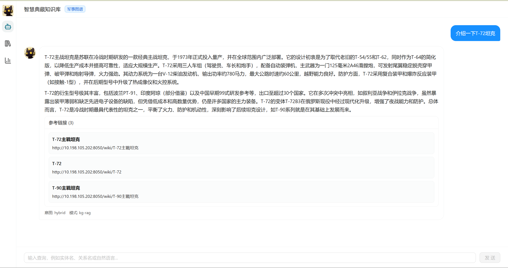
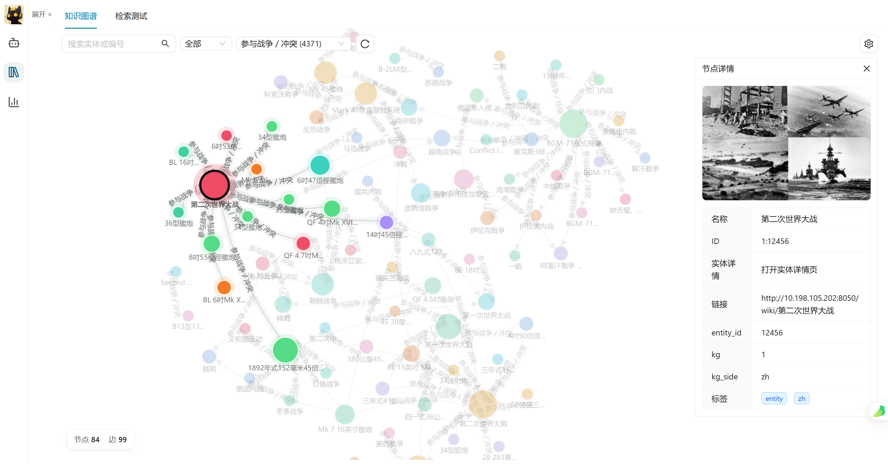

# 融合内外部数据的知识百科构建与检索增强生成

> 西安电子科技大学 本科毕业设计  
> 作者：王越洋  

本仓库实现了一个以实体为中心的统一知识框架，覆盖了从**在线百科数据采集**到**跨语言实体识别/链接/对齐**，再到**知识增强生成（KG-RAG）**的完整链路。三个任务彼此衔接，对应课题书的三项要求。

---

## 零、克隆后从 0 到 1 复刻指引

本仓库只包含**可运行的代码与全部文档**，体积约 5 MB；训练好的模型权重、原始百科数据、向量索引等**大文件未入库**，需要按下文步骤自行准备或重新生成。

```bash
# 1. 克隆代码（SSH）
git clone git@github.com:Alive0103/Knowledge-Graph.git
cd Knowledge-Graph

# 2. 创建 Python 环境（推荐 conda；Python 3.10 ~ 3.12 均可）
conda create -n kg python=3.11 -y
conda activate kg

# 3. 安装依赖
pip install -r retry/requirements_server.txt
pip install SPARQLWrapper opencc beautifulsoup4 jsonlines  # 任务 1 额外依赖

# 4. 启动 Elasticsearch 8.x / 9.x（任务 2-b、3 必需，本机或 Docker 均可）
#    PostgreSQL 仅任务 3 Web 演示需要

# 5. 按任务顺序复刻
#    任务 1：cd code && 依次运行 01_ ~ 10_ 脚本，详见 code/运行指南.md
#    任务 2：见 work_wyy/、retry/ 下的 README/UNIFIED_RUN_GUIDE.md
#    任务 3：克隆并启动 Yuxi（前后端，见 retry/doc/RAG演示系统-启动与使用指南.md）

# 6. 任务 3 Web 演示（在本仓库同级目录克隆 Yuxi）
cd ..
git clone https://github.com/xerrors/Yuxi.git
# 之后按 retry/doc/RAG演示系统-启动与使用指南.md 配置后端环境变量并启动
```

未入库的资源及来源：

| 资源 | 用途 | 获取方式 |
| --- | --- | --- |
| DBP15K (zh_en / ja_en / fr_en) | 跨语言实体对齐评测 | 公开数据集，按 `retry/UNIFIED_RUN_GUIDE.md` 中链接下载到 `data/` 下 |
| Chinese-RoBERTa-wwm-ext-large | NER 微调底座 | HuggingFace 下载到 `work_wyy/model/` |
| LaBSE / BGE-M3 / opus-mt-{zh-en,en-zh} | 对齐与翻译 | HuggingFace 下载，路径见各 README |
| 中英文维基子集 | 任务 1 产物 | 重跑 `code/01_~10_` 脚本生成 |
| 训练好的对齐 / 链接 / NER 权重 | 复用而非重训 | 按论文复现需求重训；脚本入口见 `retry/run_*.py` |

完整原始论文与答辩材料：见 [`docs/`](./docs)。

---

## 一、毕设课题任务

| 任务 | 描述 | 主要代码目录 |
| --- | --- | --- |
| 任务 1 | 编写自动采集脚本，从互联网渠道获取在线百科数据 | [`code/`](./code) |
| 任务 2 | 实体识别 / 实体链接 / 跨语言实体对齐，整合内外部知识 | [`work_wyy/`](./work_wyy)、[`retry/entity_linking/`](./retry/entity_linking)、[`retry/alignment/`](./retry/alignment)、[`跨语言实体对齐/`](./跨语言实体对齐) |
| 任务 3 | 结合实体知识与文档检索的 RAG 框架，实现智能问答 | [`retry/kg_rag/`](./retry/kg_rag) |

> 任务 3 的 Web 演示前后端是另一个仓库 `Yuxi`（上游：https://github.com/xerrors/Yuxi.git ），与本仓库并列放置；本仓库通过 `retry/kg_rag` 作为底层 API 模块被它调用，启动方式见 [`retry/doc/RAG演示系统-启动与使用指南.md`](./retry/doc/RAG演示系统-启动与使用指南.md)。

---

## 二、目录结构

```
Knowledge-Graph/
├── README.md                              # 本文件，总入口
├── code/                                  # 任务1：数据采集脚本（01_~10_ 按顺序）
│   ├── 01_wikidata_add_wikipedia_links.py
│   ├── 02_filter_chinese_wikipedia_data.py
│   ├── ...
│   ├── 10_web_display_wikipedia.py
│   ├── data22/                            # 实体链接相关的数据预处理
│   ├── 文件功能说明.md
│   └── 运行指南.md
│
├── work_wyy/                              # 任务2：NER 微调 + 本地向量检索（弥补任务2 缺陷 a）
│   ├── ner/                               # Chinese-RoBERTa-Large 微调 NER（F1=98.26%）
│   ├── local/                             # 本地 ES + 向量检索全流程
│   ├── vector/                            # 向量化与入库
│   ├── model/                             # 训练好的 NER 与翻译模型
│   ├── data/                              # zh_wiki_v2.jsonl、en_wiki_v3.jsonl
│   ├── auto_pipeline.py                   # 一键流水线
│   └── 完整使用指南.md
│
├── retry/                                 # 任务2 + 任务3：实验恢复与重跑主入口
│   ├── README.md                          # retry 模块自带说明
│   ├── UNIFIED_RUN_GUIDE.md               # 推荐入口
│   ├── alignment/                         # 跨语言实体对齐（LaBSE + 邻居图 + BGE-M3）
│   ├── entity_linking/                    # 实体链接（弱监督训练 + ES 评测）
│   ├── kg_rag/                            # KG-RAG 服务（FastAPI 内嵌使用）
│   ├── run_*.py                           # 各项实验入口脚本
│   ├── models/                            # 训练得到的对齐 / 链接模型权重
│   ├── output/                            # 实验产物（指标、checkpoint、报告）
│   ├── doc/                               # 论文素材与技术说明
│   └── logs/                              # 训练日志（答辩证据）
│
├── 跨语言实体对齐/                          # 早期 SelfKG 风格对齐代码（保留为历史快照）
│   ├── run.py
│   ├── test.py
│   ├── settings.py
│   ├── final_model.pth
│   └── 实验结果.docx
│
├── 中英文维基-部分/                         # 任务1 产出的原始建库数据（中英文维基子集）
│
├── converted-coreference-linked-with-wiki/  # 共指消解 + 链接到 wiki 的中间产物
│
├── docs/                                  # 论文中期报告、答辩 PPT、效果截图（docx/pdf/pptx/png）
├── scripts/                               # 辅助脚本（生成中期 PPT 等）
└── cmd/常用命令.md                        # 常用 ES / pip / curl 命令速查
```

---

## 三、环境要求

| 组件 | 版本 | 说明 |
| --- | --- | --- |
| Python | 3.10 ~ 3.12 | 建议 Anaconda |
| PyTorch | 2.x | retry/alignment、work_wyy/ner 需要 |
| transformers | 4.40+ | LaBSE、BGE-M3、Chinese-RoBERTa |
| Elasticsearch | 8.x / 9.x | 实体链接 ES 评测、向量检索 |
| Docker（可选） | latest | Yuxi 演示系统的 PostgreSQL/ES |

依赖清单：
- 任务 1：`pip install SPARQLWrapper requests opencc beautifulsoup4 transformers torch elasticsearch flask jsonlines tqdm`
- 任务 2 + 3：`pip install -r retry/requirements_server.txt`

---

## 四、快速开始

### 4.1 任务 1：数据采集（按编号顺序执行）

```bash
cd code
# 依次执行 01 → 10，详见 code/运行指南.md
python 01_wikidata_add_wikipedia_links.py
python 02_filter_chinese_wikipedia_data.py
python 03_wikipedia_download_content.py
# ... 直到 10
```

详细步骤：[`code/运行指南.md`](./code/运行指南.md)、[`code/文件功能说明.md`](./code/文件功能说明.md)

### 4.2 任务 2-a：NER 模型微调（27 类军事实体 + 3 类通用）

```bash
cd work_wyy/ner
python check_prerequisites.py        # 检查模型与数据
python finetune_ner_model.py         # 微调 Chinese-RoBERTa-Large
python diagnose_ner_model.py         # 测试推理效果
```

详细步骤：[`work_wyy/ner/训练与使用文档.md`](./work_wyy/ner/训练与使用文档.md)

### 4.3 任务 2-b：实体链接（弱监督 + ES 检索）

```bash
# 一键资源预检
python retry/run_prepare_experiment_assets.py --dataset zh_en --check-es --prepare-bge-model --json

# 严格全流程（实体链接训练 → ES 评测 → 对齐评测 → 老师对比报告）
python retry/run_rigorous_full_experiment.py --dataset zh_en --device cpu --include-bge-m3
```

入口文档：[`retry/UNIFIED_RUN_GUIDE.md`](./retry/UNIFIED_RUN_GUIDE.md)、[`retry/README.md`](./retry/README.md)

### 4.4 任务 2-c：跨语言实体对齐（LaBSE + 邻居图）

```bash
# 重训邻居图模型（保留旧权重 data/models/final_model.pth）
python retry/run_alignment_training.py --dataset zh_en --device cpu --epochs 150

# 评测重训后的模型
python retry/run_alignment.py --dataset zh_en eval \
  --mode final_model --device cpu \
  --model-path retry/output/alignment_training/labse_neighbor_retrained_zh_en_<run_tag>/best_model.pth \
  --json
```

### 4.5 任务 3：KG-RAG Web 演示

后端 API 模块在 `retry/kg_rag/`，前后端启动方式见：[`retry/doc/RAG演示系统-启动与使用指南.md`](./retry/doc/RAG演示系统-启动与使用指南.md)。

简化流程：

1. 启动 PostgreSQL、Elasticsearch（Docker）
2. 启动 FastAPI 后端（`Yuxi/server`，依赖本仓库 `retry/kg_rag`）
3. 启动 Vue 前端（`Yuxi/web`），访问 `http://localhost:3000`

**界面效果：**

问答主界面 —— 输入自然语言问题，由 KG-RAG 服务返回带实体溯源的答案：



知识图谱检索界面 —— 浏览实体、关系与三元组，支持跨语言对齐结果联动：



---

## 五、关键实验结果（DBP15K zh_en test）

> 结果文件：`retry/output/rigorous_full_run_rigorous_full_audited_20260322_232533/state.json`

**跨语言实体对齐**

| 模型 | MRR | Hits@1 | Hits@5 | Hits@10 |
| --- | --- | --- | --- | --- |
| Raw LaBSE baseline | 0.478 | 0.410 | 0.559 | 0.606 |
| **LaBSE + 邻居图模型** | **0.690** | **0.621** | **0.773** | **0.810** |
| Raw BGE-M3 baseline | 0.679 | 0.624 | 0.745 | 0.776 |

**实体链接 ES 评测**

| 模式 | MRR | Hits@1 | Hits@5 | Hits@10 |
| --- | --- | --- | --- | --- |
| text_only | 0.6536 | 0.5676 | 0.7635 | 0.8063 |
| vector_only | 0.0223 | 0.0158 | 0.0383 | 0.0428 |

**NER 微调（Chinese-RoBERTa-Large）**

- F1-Score：**98.26%**
- 实体类型：30 种（27 类军事 + 3 类通用）
- 训练数据规模：约 51,338 条

对齐前 vs 对齐后：

- `retry/output/experiment_comparison/zh_en_test_comparison.json`
- `retry/output/experiment_comparison/zh_en_test_comparison.md`

---


## 六、文件命名与常用命令

- 数据采集脚本命名规则：`<序号>_<英文功能名>.py`（见 [`code/文件功能说明.md`](./code/文件功能说明.md)）
- 常用命令速查：[`cmd/常用命令.md`](./cmd/常用命令.md)
