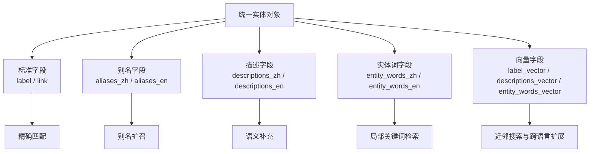
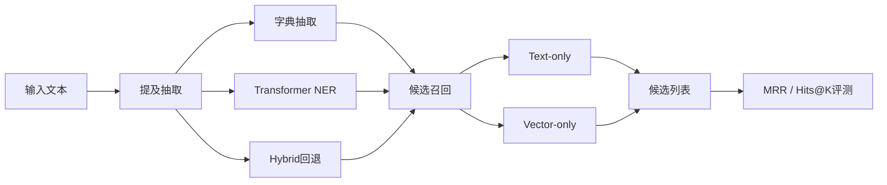
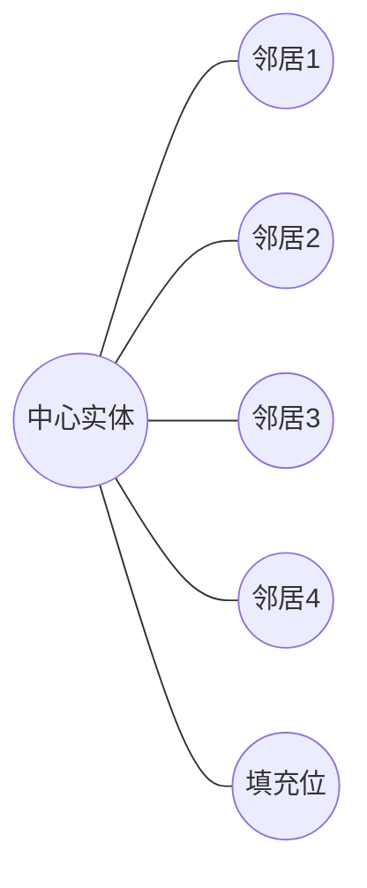
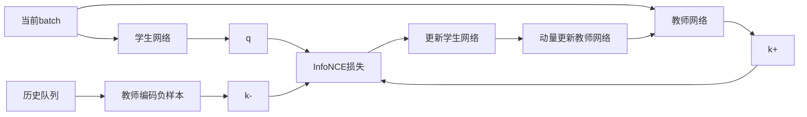
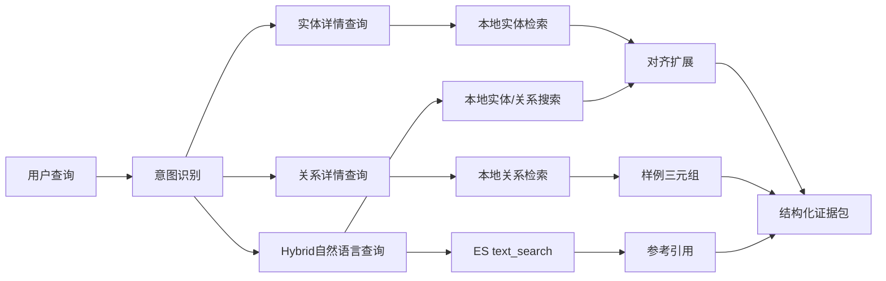
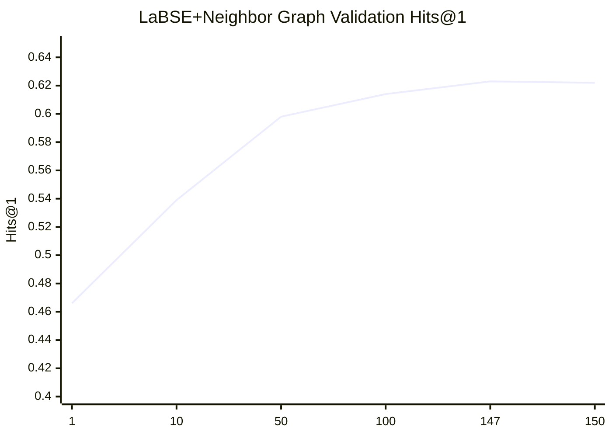

# 融合内外部数据的知识百科构建与检索增强生成

---

## 摘要

本文面向离线知识服务场景，研究融合内外部数据的知识百科构建与检索增强生成方法。针对多源知识难以统一组织、领域文本实体歧义较强以及跨语言知识难以稳定扩展等问题，本文构建了由离线知识组织、实体链接、跨语言实体对齐和知识支撑接口组成的四层技术链路。本文围绕 Wikidata、Wikipedia 及相关监督数据构建统一实体对象，形成兼容文本检索与向量检索的离线知识底座；在实体链接环节采用监督微调的实体识别模型与 Elasticsearch 候选召回机制，并对不同候选检索方式进行正式比较；在跨语言实体对齐环节，以 `LaBSE` 作为句向量型对照基线、以 `BGE-M3` 作为检索型强语义基线，构建融合邻域图增强的对齐方法，验证结构信息在不同语义起点上的稳定收益；最终基于前述结果实现面向 RAG 的知识支撑接口，为上层问答与生成提供结构化证据。

实验结果表明，在实体链接任务中，本文沿"向量模型选型→索引内容优化→检索策略升级"路径构建并比较了四条系统化评测线。在 NER 微调编码器条件下，Text-only 检索（MRR=0.6536，Hits@10=0.8063）显著优于 Vector-only（MRR≈0），揭示了分类型 [CLS] 向量与语义检索目标不对齐的根本原因；引入 BGE-M3 多语言检索型表示后，纯向量检索 MRR 跃升至 0.7149；结合 KB 对齐预测的英文实体内容注入进一步提升至 MRR=0.7333；最优配置（BGE-M3 + KB 对齐内容注入 + 智能混合检索）取得 MRR=0.8271、Hits@10=0.9032，相比 NER 基线提升超过 25 个百分点。在实体对齐任务中，LaBSE + Neighbor Graph 将 MRR 由 0.478 提升至 0.696，BGE-M3 + Neighbor Graph 取得 MRR=0.725、Hits@1=0.670，表明邻域结构信息既能够补偿句向量型语义基线在短实体名场景下的细粒度区分不足，也能够在检索型强语义基线之上继续提供稳定增益。研究表明，在高可信、可离线部署的知识服务场景中，先稳定知识组织、实体归一和跨语言扩展，再将其接入生成应用，更符合系统构建的实际需求。

关键词：知识图谱；实体链接；跨语言实体对齐；检索增强生成；离线知识服务

## Abstract

This thesis studies knowledge-encyclopedia construction and retrieval-augmented generation for offline knowledge service scenarios. To address fragmented knowledge sources, strong entity ambiguity in domain text, and the difficulty of stable cross-lingual knowledge expansion, a four-layer technical pipeline is constructed, including offline knowledge organization, entity linking, cross-lingual entity alignment, and a knowledge-support interface. Unified entity objects are first built from Wikidata, Wikipedia, and supervised resources to support both textual retrieval and vector-based representation in an offline setting. The entity-linking workflow is then implemented with a supervised entity recognition model and an Elasticsearch-based candidate retrieval mechanism. For cross-lingual entity alignment on DBP15K zh_en, LaBSE is retained as a sentence-embedding baseline, while BGE-M3 is emphasized as a retrieval-oriented strong semantic baseline and combined with neighbor-graph enhancement to examine whether structural gains remain stable under stronger semantic representations. Finally, these capabilities are integrated into a knowledge-support interface for RAG to provide structured evidence for downstream question answering and generation.

Experimental results show that, for entity linking, four experimental lines are systematically evaluated along a model-selection → content-enrichment → retrieval-strategy progression. Under the NER fine-tuned encoder, Text-only retrieval (MRR=0.6536, Hits@10=0.8063) substantially outperforms Vector-only (MRR≈0), revealing that classification-oriented [CLS] representations are fundamentally misaligned with semantic retrieval objectives. Switching to BGE-M3, a multilingual retrieval-oriented model, raises vector-only MRR to 0.7149; injecting aligned English entity content via KB-alignment predictions further improves it to 0.7333; and the best configuration (BGE-M3 + KB-aligned content injection + selective LLM hybrid retrieval) achieves MRR=0.8271 and Hits@10=0.9032, outperforming the NER baseline by more than 25 percentage points. For entity alignment, LaBSE + Neighbor Graph improves MRR from 0.478 to 0.696, while BGE-M3 + Neighbor Graph achieves the best result with MRR=0.725 and Hits@1=0.670, demonstrating that neighborhood structure can both compensate for the fine-grained discrimination weakness of sentence-embedding baselines on short entity names and continue to benefit stronger retrieval-oriented multilingual representations. The study shows that, in high-trust offline knowledge service scenarios, stabilizing knowledge organization, entity normalization, and cross-lingual expansion before generation is a more reliable system-building strategy.

Keywords: knowledge graph; entity linking; cross-lingual entity alignment; retrieval-augmented generation; offline knowledge service

## 目录

1. 第1章 绪论  
2. 第2章 实体链接  
3. 第3章 实体对齐  
4. 第4章 RAG搭建  
5. 第5章 实验分析  
6. 第6章 结论  
7. 致谢  
8. 参考文献  

---

# 第1章 绪论

## 1.1 研究背景

随着大语言模型和检索增强生成技术的快速发展，知识服务系统正从“返回相关文档”转向“围绕证据组织知识并生成回答”。这一趋势在通用互联网场景中已较为明显，但在军事、应急、装备管理等特殊领域，知识服务的核心要求并不只是“能回答”，而是“回答是否建立在稳定、可追溯、可核验的知识基础之上”。这意味着系统设计的重心不能只停留在生成端，而必须向前追溯到知识组织、实体理解与证据组织环节。

当前组织级知识服务之所以难以稳定落地，根本原因在于知识来源、实体表达和部署条件并不处于同一个可控平面之上。内部私有知识往往以项目文档、结构化表格、术语库和数据库记录的形式存在，外部开放知识则来自百科、公开知识图谱以及跨语言资源，二者在标识体系、字段规范和更新节奏上通常并不一致；与此同时，军事领域实体又普遍带有简称、型号、代号、别名和翻译变体，单纯依赖关键词匹配极易造成漏召回或误匹配；更进一步地，无网或弱网环境又要求核心能力能够离线运行，这意味着系统必须在本地完成知识组织、实体检索与证据扩展，而不能把关键步骤外包给在线搜索或云端接口。也正因为这三层约束相互叠加，离线知识服务的问题从一开始就不是单纯的检索问题，而是知识表示、实体归一和系统部署共同作用下的综合问题。

如果进一步从领域文本本身观察，这些矛盾还会以更具体的形式显现。例如，“长征”既可能指代历史事件，也可能指代运载火箭系列；“东风”既可能是普通词汇，也可能指代导弹型号族。类似现象表明，特殊领域知识服务的难点并不只是“资料是否充足”，更关键的是“系统能否把文本中的提及稳定还原到正确的知识对象”。一旦这一还原过程不稳定，即便后端生成模型具备很强的语言组织能力，也仍可能在错误证据之上生成流畅却不可靠的答案。

如果从知识服务链路来看，问题并不发生在同一层。知识组织解决的是“库中有什么”和“这些知识能否统一表达”；实体链接解决的是“文本中提到的对象到底对应库中的哪个实体”；实体对齐解决的是“内部实体是否可以关联到外部知识空间中的等价实体”；而 RAG 或问答生成解决的是“在已有证据基础上如何组织成对用户友好的答案”。因此，本文并不把这些问题视作若干彼此独立的模块，而是把它们理解为从知识入库到知识利用的连续过程。只有前面的实体识别、实体消歧和跨语言补全做得足够稳定，后续的知识增强生成才有可信基础。

为进一步概括上述问题链路，图1.1给出了组织级离线知识服务的问题闭环。

图1.1 组织级离线知识服务的问题闭环示意图

## 1.2 研究意义

本文的研究意义不仅体现在应用落地层面，也体现在方法认识与工程组织层面。更准确地说，本文试图回答的不是某一单点模型是否还能继续提分，而是离线知识服务在面对高可信要求时，应当以什么样的知识结构、实验路径与系统边界来支撑后续应用。

从应用层面看，离线知识服务对特殊领域具有直接现实价值。军事领域中的知识查询并不总是发生在开放网络环境中，许多实际场景更强调本地可部署、过程可审计和结果可追溯。在这类场景下，一个看似“智能”的系统如果无法说明答案来自哪些实体、哪些关系和哪些证据，实际上难以被真正信任。本文从知识组织、实体链接和跨语言实体对齐出发，为后续知识增强生成提供结构化证据底座，本质上是在提升系统的可信性、可控性与可核验性。

从方法层面看，本文关注的是“生成能力之前的知识能力”。当前大量工作倾向于直接讨论如何让模型回答得更像人，但在专业领域中，用户往往更在意“实体是否识别正确”“候选是否召回充分”“外部知识是否补齐”“答案是否有源可追”。因此，本文将知识组织、实体链接和实体对齐作为核心主线，本身就体现了一种方法论判断：在高可信领域中，先把知识结构稳住，比直接追求生成多样性更重要。换言之，本文试图把“知识如何被组织并可信地送到生成端”这一通常被弱化的问题，重新放回系统设计的中心位置。

从工程层面看，本文还具有“中等复杂度可落地”的意义。与完全依赖大型在线系统不同，本文采用 Elasticsearch 统一承载文本字段和向量字段，采用可重训的 NER 微调与可复现的 DBP15K 对齐实验，并以 `kg_rag` 将实体查询、关系检索和对齐扩展封装为服务接口。这条路线虽然没有追求最复杂的端到端大模型系统，却更符合本科毕业设计对于“问题清楚、链路完整、结果可复现、边界可说明”的要求，也更符合离线知识服务的真实部署逻辑。

## 1.3 国内外研究现状

围绕本文所涉及的核心问题，现有研究大体可以从实体链接、实体对齐和 RAG 三条线索加以梳理。首先，在实体链接方面，相关工作通常围绕实体提及识别与候选消歧两个关键环节展开。国内研究在中文场景下尤为关注语义歧义、别名表达和短文本上下文不足等问题。一类方法通过改进编码器结构、融入知识库标记或多任务学习来提升实体判别能力[1][2]；另一类方法则更强调垂直领域适配，通过领域数据增强、别名扩展和知识融合改善长尾实体的召回与消歧效果[3][4]。这类研究说明，在中文专业领域中，实体链接的核心困难往往不在“是否知道某个实体存在”，而在“文本里这一段具体提及到底对应哪个标准实体”。

国外研究在检索式实体链接与端到端实体链接上发展较快。双编码器用于大规模候选召回、交叉编码器用于细粒度排序的两阶段范式已经较为成熟[5]；同时，一些工作通过零样本、抽取式判别或端到端框架减少对高质量标注数据的依赖[6][7]。这些方法提高了实体链接的扩展性，但其前提通常是拥有更丰富的开放知识库、更成熟的标准语料和更稳定的在线算力支撑。

对于本文关心的离线军事场景，上述研究仍存在与任务边界不完全贴合之处。通用实体链接方法通常默认实体语义可以通过通用描述被充分表达，但军事领域中大量实体实际上呈现出明显的型号驱动和别名驱动特征；许多高性能方案又默认可调用在线大规模检索系统，而本文更强调本地可部署；此外，不少研究倾向于把“语义向量检索”预设为更强路线，但在专业领域中，实体标准名与别名往往比稠密语义向量更有判别力，尤其是在提及形式高度规范化时，这一判断不能依赖直觉，只能依赖正式实验加以验证。

进一步看，在实体对齐尤其是跨语言实体对齐方面，研究目标是在不同知识图谱中识别语义等价的实体。相关工作大体沿着两条主轴演进：一条主轴围绕名称、属性和描述相似度构建语义匹配能力，另一条主轴围绕图结构与关系模式挖掘实体所处位置的可比性，近年的代表性方法则更多尝试把这两类信息联合起来建模[8][9]。随着跨语言预训练模型的发展，语义表示模型在对齐任务中的作用越来越重要，但大量研究也指出，仅靠名称或描述仍难以稳定区分语义接近却非同一对象的实体。

结构增强方法的核心思想在于：即使两个实体的名称存在翻译差异，它们在局部邻域中的关系模式仍可能相似。例如，两个装备实体如果都与某些同类关系、所属国家、服役时期或上级类别形成相似连接，那么结构信息可以对纯语义表示形成补偿。图神经网络尤其是图注意力网络以及邻域感知表示方法因此被广泛用于实体对齐、关系预测和知识图谱补全[10][16]。但图模型也并非越复杂越好，结构越深、邻域越大，噪声传播和训练不稳定问题也越明显。

从本文所处项目环境来看，跨语言实体对齐的研究结论可以概括为一句话：语义表示决定模型的起点，图结构增强决定模型能否进一步逼近正确匹配。因而，本文没有采用仅依赖向量最近邻匹配的简化路线，也没有采用过于复杂的全图深层传播，而是选择了可控的一跳邻域增强方案。

在生成应用层面，RAG 通过“先检索，再生成”的方式缓解大模型的知识陈旧和事实幻觉问题[11]。近年来，研究热点逐步从传统文档级 RAG 扩展到知识图谱增强 RAG、GraphRAG、多模态 RAG 和闭环检索优化等方向[12][13]。相关综述与路线图研究进一步指出，RAG 系统的关键竞争力不仅取决于生成模型本身，还取决于检索对象如何组织、知识源是否结构化以及证据能否被追溯[26][27]。国内研究更加关注中文场景、轻量化部署和特定领域知识库适配，国外研究则更多讨论多跳推理、结构化知识注入和复杂检索策略。

然而，若将 RAG 放到本文的语境中来看，一个常见误区是把“能生成”当成“能回答得可信”。在特殊领域里，RAG 的关键瓶颈往往不是生成模型本身，而是检索之前的实体归一化、候选召回和外部知识扩展能力。如果前端实体链接不稳定，模型拿到的证据就可能已经偏了；如果跨语言实体对齐没有做好，外部开放知识就难以被有效吸收。因此，本文不把 RAG 视作单独凌驾于所有模块之上的中心，而把它定义为“依赖前述知识能力的应用层能力”。

综合以上研究可以发现，现有方法与本文所面对的问题之间仍存在明显张力。许多实体链接研究预设通用语义模型足以覆盖专业领域文本，但军事实体的型号化、系列化和别名化特征决定了字面匹配仍然具有很强的判别力，因此“语义表示更强”并不必然等价于“候选召回更优”。不少实体对齐研究强调更复杂的结构建模，却较少讨论在工程约束下如何选择“足够有效而不过度复杂”的结构增强方式，这使得方法虽然在论文中精巧，却未必适合迁移到离线知识服务系统。与此同时，相当一部分 RAG 研究将重心放在生成端，而缺少对前端实体理解、知识归一和跨语言知识扩展的系统性讨论，因而难以回答“生成所依据的证据究竟是否稳定”这一更基础的问题。针对离线或弱网环境的知识服务研究也仍显不足，尤其缺少既可复现、又能把结构化知识、实体归一和上层应用连接起来的完整工程链路。

这些不足共同构成了本文的研究出发点，也决定了本文必须同时回答“知识如何组织”“实体如何稳定归一”“外部知识如何谨慎扩展”以及“这些能力如何服务上层应用”四个彼此关联的问题。

## 1.4 研究问题定义与目标

基于上述背景，本文聚焦四个彼此衔接的研究问题。首先需要回答的是，多源知识如何在离线环境中被统一组织。若实体标签、别名、描述和向量表示没有形成稳定的字段体系，那么后续的候选检索、对齐扩展和证据拼装都难以可靠实现，因此本文首先讨论知识对象应如何被组织，以及如何在本地构建兼容文本检索与向量检索的索引。

在此基础上，第二个问题转向实体链接的主召回方式选择。通用直觉往往会认为“向量检索更先进，因此应该更好”，但本文希望基于正式评测回答一个更具体、也更贴近任务本身的问题：在军事领域、别名丰富、实体命名规律较强的场景中，究竟是文本字段匹配更有效，还是纯向量检索更有效。

第三个问题关注跨语言实体对齐能否为知识扩展带来稳定收益。内部中文知识与外部英文知识之间并不能靠简单翻译自然连通，因此本文希望验证，在 DBP15K `zh_en` 数据集上，将语义表示与邻域结构增强结合之后，是否能够显著提升实体对齐性能，并由此为知识补全提供可信依据。

第四个问题则落到系统层面，即如何将这些能力组织成可服务于 RAG 的知识支撑层。本文并不试图在当前版本中证明完整生成系统已经最优，而是希望说明：如果实体链接和实体对齐足够稳定，那么系统应如何以结构化接口的形式向上提供实体、关系、三元组和对齐证据，从而降低后续 RAG 过程中的知识缺失与事实漂移风险。

由此，本文的总体目标可以概括为：**构建一条面向离线知识服务的知识组织、实体链接和跨语言实体对齐链路，并在此基础上形成可用于 RAG 的结构化证据支撑能力。**

需要指出的是，这四个问题之间并不是简单并列关系，而是构成一条由“知识入库”通向“知识利用”的递进链路。为便于后续论证，本文将研究问题、技术路径与验证方式之间的对应关系概括如下。

**表1.1 研究问题、技术路径与验证方式对应关系**

| 研究问题 | 核心技术路径 | 主要验证方式 |
| --- | --- | --- |
| 多源知识如何统一组织 | 字段体系设计、本地索引构建、离线知识对象组织 | 代码实现与索引结构分析 |
| 实体链接主召回方式如何选择 | NER 微调、`Text-only` 与 `Vector-only` 检索评测 | MRR、Hits@K 正式结果对比 |
| 跨语言实体对齐能否稳定增益 | 原始语义基线、邻域图增强、对比学习训练 | DBP15K `zh_en` 上的增强前后对比 |
| 如何形成面向 RAG 的知识支撑层 | `kg_rag` 查询路由、证据组织、对齐扩展 | 接口能力与系统边界分析 |

## 1.5 本文主要工作与贡献

结合本文的研究目标与正式实验结果可以看到，其贡献并不体现为提出一种全新的基础模型，而体现为围绕离线知识服务重新组织问题链路，在关键环节上给出可复现的实验验证，并据此界定系统能力边界。对于本科毕业论文而言，这种贡献形式更符合研究真实性，因为它不仅回答了“做了什么”，也回答了“为什么这样做”以及“哪些结论已经能够被证实”。

本文首先构建了面向离线场景的统一知识对象组织方案。通过将实体标签、别名、描述、实体词及其向量表示纳入同一实体对象，知识不再以彼此割裂的原始片段存在，而被组织为可检索、可扩展、可服务的结构化单元。由此，知识组织不再只是实验开始前的数据预处理步骤，而成为决定后续实体归一、跨语言扩展与证据输出上限的基础层。

在这一基础之上，本文建立了由监督微调实体识别模型和 Elasticsearch 候选召回组成的实体链接实验链路，并将候选检索方式控制为 `Text-only` 与 `Vector-only` 的单因素对比。这样的设计价值并不在于展示更多方案，而在于用统一证据边界回答一个更根本的问题：在命名规律强、别名丰富的专业领域中，究竟哪类信号真正承担主召回作用。正式结果表明，名称、别名和描述等文本字段仍是当前任务中最稳定的判别依据，这一结论也为后续系统优化提供了明确方向。

在跨语言实体对齐方面，本文以 `BGE-M3` 作为重点检索型强语义基线，以 `LaBSE` 作为句向量型对照基线，构建了融合邻域图增强的对齐方法。这样的设置使论文既能够观察结构信息对较弱语义起点的补偿效应，也能够检验在较强语义表示已经成立的前提下，结构增强是否仍具独立价值。实验结果说明，邻域结构并不是只在弱基线上才有效的临时补丁，而是能够与强多语言语义表示形成稳定互补的知识信号。

在应用层面，本文将实体查询、关系检索、三元组返回与对齐扩展封装为 `kg_rag` 服务接口，使结构化知识能够以分层证据形式被上层系统调用。由此，RAG 在本文中被界定为建立在实体归一、跨语言扩展和证据分级之上的应用落点，而不是被提前夸大为已经完成闭环评测的最终系统。综合而言，本文的贡献可以概括为：围绕离线知识服务建立了一条从知识组织到知识支撑接口的完整链路，并在实体链接与实体对齐两个关键环节上给出了具有解释力的正式实验结论。

## 1.6 论文组织结构

本文共分为六章。第1章介绍研究背景、研究意义、研究现状以及本文的研究问题和主要工作。第2章围绕实体链接展开，重点阐述离线知识组织、字段设计、提及抽取、索引构建与候选评测方案。第3章围绕实体对齐展开，介绍数据集组织、原始语义基线、邻域图增强模型及其训练策略。第4章说明 RAG 的搭建思路，重点讨论 `kg_rag` 如何组织查询路由、对齐扩展与结构化证据输出。第5章给出完整实验环境、实施步骤与结果分析，对实体链接和实体对齐两条主线进行统一讨论。第6章对全文工作进行总结，并给出不足与展望。

---

# 第2章 实体链接

## 2.1 数据来源与知识组织

结合本文实现所依赖的正式数据与实验链路可以看到，本文使用的数据来源具有明确的功能分层。Wikidata 与 Wikipedia 共同构成外部开放知识底座，前者提供结构化实体标识、标签和别名，后者提供更加丰富的自然语言描述与语义补充；领域监督标注数据用于实体识别微调，是实体链接实验能够成立的直接训练基础；DBP15K `zh_en` 数据集则承担跨语言实体对齐的标准评测任务，用于验证语义表示与结构增强方法的有效性。不同数据来源在本文中并非简单并列存在，而是分别服务于知识对象构建、实体入口稳定和跨语言扩展验证这三个层次。更一般地说，知识图谱关于表示、获取与应用的研究已经为这种面向任务的知识组织方式提供了较成熟的方法基础[25][28]。

在这样的数据背景下，本文中的“离线知识组织”并不等于简单存储原始 JSON 或文本，而是要把这些异构信息组织为可检索、可扩展、可服务的实体对象。更具体地说，知识组织阶段必须同时完成对实体本体字段、语义补充字段、检索增强字段和向量支撑字段的统一组织：标签和别名用于描述实体本身，中英文描述用于补充语义上下文，由描述抽取得到的实体词用于增强局部检索线索，而向量字段则为近邻搜索和跨语言扩展提供基础表示。因此，离线知识组织实际上构成了后续实体链接与知识支撑能力的上限。如果这里的字段设计粗糙，后面的检索、对齐扩展与问答支撑都只能建立在一个不稳定的知识底座之上。

从实验设计逻辑看，本文并不是先训练模型再回过头补知识库，而是先稳定实体对象，再讨论提及抽取与候选召回。原因在于，实体链接同时受两端制约：输入端的不确定性来自文本中的实体提及，输出端的确定性来自知识库中的实体对象。如果底层知识对象尚未统一，后续无论采用何种识别模型或检索策略，都难以判断性能变化究竟来自模型本身还是来自知识组织质量的改变。正因为如此，本文将知识组织作为实体链接实验的第一个环节，使后续各步骤都建立在同一套可复用、可追溯的实体对象之上。

如图2.1所示，离线知识组织并不是一次性导入过程，而是经历字段清洗、描述补全、实体词抽取、向量编码与索引构建等连续步骤后，才逐步收敛为统一实体对象。

图2.1 数据预处理与离线知识组织流水线示意图

## 2.2 实体字段与对象构建

在完成多源数据清洗与归一化之后，本文进一步将离线知识对象组织为一组具有明确功能分工的实体字段。处理后的 JSONL 记录不仅保留实体标签、别名和描述等基础属性，还加入了围绕实体词抽取与统计构建的中间字段，如 `_entity_words_zh`、`_entity_words_en`、`_entity_freq_zh`、`_entity_freq_en`、`_entity_count_zh`、`_entity_count_en`、`_entity_count_total`、`_entity_words_zh_vector` 和 `_entity_words_en_vector`。这些字段共同构成了后续检索与分析所依赖的统一实体表示。

这些字段的设计体现了一项重要判断：**实体检索不应只依赖原始标签，也不应直接把整段描述整体向量化，而应先抽取与实体高度相关的局部词项，再决定是否进行向量表示。** 这样做的直接价值在于，抽取得到的 `entity_words` 比原始长描述更紧凑，更接近实体判别真正依赖的局部语义线索；中英文分别保留词项与向量字段，又为后续跨语言扩展留下了统一接口；而 `_entity_count_total` 等统计信息则使系统能够区分“实体本身信息充分”与“实体描述先天稀疏”这两类完全不同的问题来源。换言之，这套字段设计并不是为了把数据做得更复杂，而是为了把后续检索、扩展和误差分析依赖的信号提前组织成可复用对象。

**表2.1 离线实体对象的核心字段设计**

| 字段名 | 类型 | 用途 | 来源 |
| --- | --- | --- | --- |
| label | 文本 | 实体标准名，用于精确匹配 | Wikidata标签 |
| aliases_zh / aliases_en | 文本列表 | 别名扩展召回 | Wikidata别名 |
| descriptions_zh / descriptions_en | 文本 | 语义检索补充 | 维基百科页面 |
| entity_words_zh / entity_words_en | 文本列表 | 局部关键词检索 | 由描述抽取 |
| _entity_words_zh_vector / _entity_words_en_vector | 1024维向量 | 向量近邻搜索 | Transformer编码 |
| _entity_freq_zh / _entity_freq_en | 词频字典 | 实体词统计分析 | 抽取过程统计 |
| _entity_count_total | 整数 | 信息完整度指标 | 计算得出 |
| link | keyword | 去重键与溯源 | 维基百科链接 |

需要指出的是，处理中间产物多以 `_entity_words_*` 的形式存在，而进入索引后的逻辑字段则多写作 `entity_words_*`。前者对应数据加工阶段的过程性结果，后者对应检索对象层面的稳定字段语义。二者在命名上的区分，反映的并不只是实现细节差异，而是从原始数据处理到统一知识对象构建的层次转换。

从处理流程看，本文采用分阶段流水线完成知识对象构建。原始数据经清洗与格式归一化后，首先消除无效字符和异构表示，再对缺失的描述与别名字段进行补全，并从描述文本中抽取与实体相关的关键词和短语，形成更适合用于检索的局部语义线索；在此基础上，相关实体词被进一步编码并保存为 1024 维向量。经过这一流水线后，实体对象不再只是静态条目集合，而成为兼具文本检索支撑、语义补充与向量表示能力的离线知识单元。

数据最终以 JSONL 形式统一存储，如 `zh_wiki_v2.jsonl` 与 `en_wiki_v3.jsonl`，并在中英文分别处理后进一步生成 `entity_words_zh.jsonl` 与 `entity_words_en.jsonl`。这种“按语言分离处理、按字段统一组织”的方式既便于后续分别执行中文与英文检索，也为跨语言向量合并保留了接口。当同一实体同时具备中英文向量表示时，可通过均值池化并结合 L2 归一化得到合并向量 `label_vector`，从而为跨语言检索与扩展场景提供基础表示。

图2.2进一步展示了统一实体对象上的多字段索引结构，以及不同字段在文本匹配、别名扩召、语义补充和近邻搜索中的功能分工。

图2.2 Elasticsearch 多字段索引结构示意图

## 2.3 提及抽取与实体识别

实体提及抽取是实体链接流程的入口，其稳定性直接决定后续候选召回的上限。为兼顾领域适配、离线可部署性与复杂上下文下的识别能力，本文并未采用单一路径完成提及抽取，而是构建了由字典抽取、Transformer NER 与混合回退组成的联合入口。字典抽取依赖实体标签与别名构造别名字典，并结合长度优先的贪心匹配策略完成提及发现；在实现上，还对 URL、超长别名以及拉丁字符与 CJK 字符的匹配边界进行专门处理，因此具有稳定、可解释、易部署的优点，但对新变体和复杂上下文的适应能力有限。Transformer NER 路径则基于 Hugging Face 的 token classification 模型，并利用 fast tokenizer 的 offset mapping 将 token 级预测还原到字符级文本，从而增强模型对上下文表达的处理能力。就方法范式而言，该路径属于基于 BERT 系预训练语言模型的序列标注方案，其演进基础与 BERT、RoBERTa 以及中文 whole word masking 等工作密切相关[18][19][20]。最终实际采用的是 `HybridMentionExtractor`，即优先保留 Transformer 的识别结果，在模型未抽取到实体时再回退到字典匹配。这样的设计体现的并非简单的模块叠加，而是在离线场景下对稳健性与表达能力之间平衡关系的主动控制。

也正因为如此，本文并不把实体识别理解为一次性的模型推断，而将其理解为“模型能力 + 规则回退”的联合入口。对离线系统而言，这种联合入口的价值在于：它在保持模型表达能力的同时，为边界样本和极端输入保留了最低限度的稳定兜底机制。

这一环节之所以必须在候选召回之前被单独论述，是因为候选检索的上限首先受输入提及质量限制。若提及边界本身不稳定，则文本检索与向量检索会同时失真，后续比较也无法成立。因此，本文先通过“字典 + Transformer + 回退”尽量稳定实体入口，再在同一提及基础上比较不同候选召回方式，这样实验结论才具有可解释性。

图2.3给出了实体链接从提及抽取到候选评测的完整处理流程。

图2.3 实体链接完整流程图

实体识别模型的正式训练入口为 `run_entity_linking_training.py`，其底层调用 `entity_linking/training.py` 中的 `train_token_classifier`。模型以 `AutoModelForTokenClassification` 为基础进行监督微调，训练过程中使用 fast tokenizer 保留 offset 信息，使标签能够从字符级映射到 token 级；标签集合并非预先固定，而是依据训练语料中的实体类型动态构造 `B-`/`I-` 标签映射。与此同时，训练指标采用 token 级准确率以及正类 token 的 Precision、Recall 和 F1，而非严格的实体级 exact-match F1。也正因如此，本文对 NER 结果的解释首先服务于“实体入口是否稳定”这一问题，而不直接将其等同于开放场景中的完整实体识别能力。

这里尤其需要指出的是，当前实现中的 `positive_f1` 是对所有非 `O` 标签 token 的整体统计，而不是实体 span 级别的严格评测。这意味着它适合衡量“模型是否能把实体区域大体找出来”，但不能直接等价为“复杂开放场景下边界一定完全正确”。因此，本文在解释 NER 结果时将其定位为**高质量实体入口**，而不是将其夸大为“实体识别问题已经彻底解决”。

表2.2给出了监督微调实体识别模型的配置与结果。

**表2.2 实体识别模型正式结果**

| 指标 | 数值 |
| --- | ---: |
| 训练集样本数 | 2679 |
| 验证集样本数 | 444 |
| 训练轮数 | 5 |
| 最大长度 | 256 |
| 批大小 | 4 |
| 最优轮次 | 4 |
| Token Accuracy | 0.9737 |
| 正类 Precision | 0.8342 |
| 正类 Recall | 0.7754 |
| 正类 F1 | 0.8037 |

从代码默认配置可以进一步看出，训练阶段的优化器为 `AdamW`，学习率与权重衰减分别使用 `5e-5` 和 `0.01` 的默认值。结合结果来看，模型在 token 级别已经学到了稳定的实体区分能力，但正类 F1 与总准确率之间的落差也提醒我们：数据分布仍然存在明显的“非实体多、实体少”的不平衡特征。

## 2.4 候选检索与方法分析

实体链接的核心难点并不止于识别文本中的提及，还在于如何从知识库中召回并区分语义相近的候选实体。为此，本文采用 Elasticsearch 作为候选召回后端，并围绕统一实体对象构建多层字段索引，而非将文本与向量表示拆分为彼此独立的候选库。其中，`label`、`aliases_zh`、`aliases_en`、`descriptions_zh`、`descriptions_en` 与 `content` 共同构成文本检索层；`entity_words_zh` 与 `entity_words_en` 作为局部关键词增强层；`entity_words_zh_vector`、`entity_words_en_vector`、`label_vector`、`label_zh_vector`、`label_en_vector`、`descriptions_zh_vector` 与 `descriptions_en_vector` 则构成向量近邻搜索层。这样的索引组织方式意味着，候选召回面对的不是两套相互割裂的对象体系，而是围绕同一实体构建的多视角判别结构。

在这一阶段，本文有意将正式实验先收敛为 `Text-only` 与 `Vector-only` 两条单因素对比线，而没有一开始就引入复杂混合检索、LLM 重排序或多阶段融合。这样处理并非追求实现上的简化，而是为了先回答一个更基础、也更关键的问题：当前任务的主判别信号究竟来自名称与别名等文本结构，还是来自稠密语义表示。只有先把这一层因果关系说明清楚，后续更复杂的融合策略才有明确的优化方向；否则，即便指标有所提升，也很难解释提升究竟来自何处。

这种统一索引策略对于后续知识支撑层同样重要。系统在返回某一实体时，不仅能够给出“命中了谁”的结果，还能够继续复用该实体对象上的描述、关键词与向量表示，从而避免检索层与服务层之间再次进行对象拼装。由此，候选召回不再只是排序问题，也同时成为知识对象能否被连续利用的问题。

文本检索 `text_search` 采用基于 BM25 的多字段 `should` 匹配[24]，权重分别为：`label=4.0`、`aliases_zh=3.0`、`aliases_en=3.0`、`descriptions_zh=1.5`、`descriptions_en=1.5`。这一实现反映出本文对实体链接问题的基本认识：在当前场景中，实体标准名和别名仍然是最强的判别特征，描述字段更多用来弥补字面不完全一致的问题，而不宜本末倒置让长描述主导检索。

向量检索 `vector_search` 则主要在 `entity_words_zh_vector` 和 `entity_words_en_vector` 上执行 KNN 搜索。需要注意的是，当前正式 `vector_only` 评测并没有直接把 `label_vector` 和 `descriptions_vector` 纳入检索主字段，这意味着它评价的是一种更聚焦于“抽取实体词后再做语义相似”的方案，而不是对所有向量信息进行最优融合后的结果。

文本检索显著优于纯向量检索并非偶然现象，而是由任务信号形态与表示方式共同决定的。军事装备、型号、组织简称和标准称谓通常带有稳定的专名结构，许多实体名称同时包含数字、字母和连字符组合，别名与标准名之间也往往保留较强的字符串重叠关系。因此，经过字段权重控制的文本检索能够较直接地利用任务真正依赖的判别线索。相比之下，向量侧并不是围绕实体近邻排序目标专门训练得到的：正式重训流程中用于构造向量的 Transformer 目录复用了微调后的 NER 模型，其主要优化目标是识别实体 token，而不是学习适合候选召回的实体相似度空间；在具体实现上，又采用 `AutoModel` 的 `last_hidden_state[:, 0, :]` 并对多个实体词向量求平均，这种做法虽然实现简洁，但难以保证得到的表示天然适用于实体检索排序。

与此同时，向量检索所面对的也并不是完整实体对象，而是抽取后的局部实体词。`vector_only` 主要依赖 `entity_words_zh_vector` 与 `entity_words_en_vector`，这确实降低了长描述噪声，却同步削弱了标签和别名等最具区分度的知识字段。一旦候选召回阶段无法将正确实体稳定送入前列，后续再精细的判别也难以补救。因此，`vector_only` 的弱结果并不意味着语义检索没有价值，而是更准确地说明：在本文采用的编码目标、字段选择和数据形态下，向量表示尚不足以独立承担候选召回主链路。

这个结论具有方法论意义：**在专业领域场景中，不能把“向量化”当作天然更高阶的方案。是否使用向量、如何使用向量，必须接受正式评测的约束。**

## 2.5 评价指标与评测方案

当前正式评测由 `run_entity_linking_es.py eval --mode both` 触发，评测文件读取 `find.xlsx` 中的查询与正确链接对，并以候选排序视角计算 `MRR` 与 `Hits@K` 指标。若将查询集合记为 $Q$，其中每个查询的正确实体排名为 $\text{rank}_q$，则平均倒数排名可写为：

$$
\text{MRR} = \frac{1}{|Q|}\sum_{q \in Q}\frac{1}{\text{rank}_q}
$$

该指标更关注正确答案究竟被排到了多靠前的位置。与之对应，`Hits@K` 衡量正确实体是否进入前 $K$ 个候选，其形式可写为：

$$
\text{Hits@}K = \frac{|\{q \in Q : \text{rank}_q \le K\}|}{|Q|}
$$

因此，`Hits@1` 关注首位命中能力，`Hits@5` 与 `Hits@10` 则更强调候选集覆盖能力。

之所以选择这组指标，而不只使用单一准确率，是因为实体链接本质上是候选排序问题。对离线知识服务而言，系统不必在所有样本上都一击命中第 1 位，但至少应保证正确实体较大概率进入一个足够小的候选集，从而为后续人工确认、规则重排或大模型辅助判别留下空间。

# 第3章 实体对齐

## 3.1 任务定义与数据集

跨语言实体对齐的目标是在不同语言的知识图谱中识别语义等价实体。对于本文而言，这一任务的意义并不止于完成一个标准评测基准上的实验，而在于为内部中文知识与外部英文知识建立桥梁，使离线知识服务系统能够在必要时扩展到更广的外部知识空间。

本文选用 DBP15K `zh_en` 数据集作为正式评测集[8]。该数据集由实体编号映射、关系编号映射、双侧三元组以及 `train`、`valid`、`test` 三部分对齐对共同构成，其中 `cleaned_ent_ids_1` 与 `cleaned_ent_ids_2` 保存两侧知识图谱的实体编号和名称映射，`cleaned_rel_ids_1` 与 `cleaned_rel_ids_2` 保存关系编号和名称映射，`triples_1` 与 `triples_2` 提供双侧三元组集合，`ref_ent_ids` 则提供对齐参考映射。就本文的实验组织方式而言，DBP15K 并不是一组被动读取的文本文件，而是被进一步整理为可建索引、可取邻域、可回查结果的数据对象。

`DBP15KDataset` 类会在初始化时完成实体、关系、三元组和对齐对的读取，并进一步建立实体三元组索引、关系索引和对齐查找表。这意味着对齐任务在项目中不是孤立的一次性评测，而是被组织为可查询、可分析、可服务的知识对象。

**表3.1 DBP15K `zh_en` 数据组织说明**

| 文件或对象 | 含义 | 在本文中的作用 |
| --- | --- | --- |
| `cleaned_ent_ids_1` / `cleaned_ent_ids_2` | 两侧知识图谱的实体编号与名称映射 | 构造实体索引与实体查询对象 |
| `cleaned_rel_ids_1` / `cleaned_rel_ids_2` | 两侧知识图谱的关系编号与名称映射 | 构造关系索引与关系检索对象 |
| `triples_1` / `triples_2` | 两侧知识图谱的三元组集合 | 生成邻域图与局部结构特征 |
| `train` | 训练对齐对 | 对比学习与参数训练 |
| `valid` | 验证对齐对 | 模型选择与早停参考 |
| `test` | 测试对齐对 | 正式结果评估 |
| `ref_ent_ids` | 对齐参考实体映射 | 结果查找与分析辅助 |

上述数据组织方式意味着，本文对实体对齐的讨论并不是只围绕最终排名展开，而是能够回溯到实体、关系和三元组层面分析模型为什么有效、又在什么地方仍然失效。这一点对于后文的方法解释和误差分析都至关重要。

## 3.2 语义基线与邻域构建

为客观评估邻域结构增强对跨语言实体对齐的实际贡献，本文首先构建不含图结构信息的原始语义基线。考虑到不同多语言预训练模型在表示能力上的差异，本文选取 `LaBSE` 与 `BGE-M3` 作为两类代表性语义编码器。其中，`LaBSE` 用于刻画传统跨语言句向量模型在实体级匹配任务中的基础对齐能力，`BGE-M3` 用于刻画更强多语言检索型表示在同一任务中的语义起点。这样的基线设置使后续比较不再停留于“图增强模型是否优于某一基线”的表面结论，而能够进一步分析结构信息在较弱语义起点与较强语义起点上的作用方式。

本文将 `BGE-M3` 设为重点强语义基线，从模型结构上看，`BGE-M3` 建立在统一的多语言 Transformer 编码主干之上，但其训练目标并不局限于生成单一全局向量，而是同时面向 dense retrieval、sparse retrieval 与 multi-vector retrieval 三类检索形式进行建模，并通过自知识蒸馏使这些不同检索视角在同一表示空间内彼此约束、协同收敛。这样的设计意味着，编码器在学习跨语言语义对应关系的同时，也持续接收词项重要性估计和 token 级局部交互信号的监督。因此，`BGE-M3` 所形成的表示不只是对整段文本主题语义的压缩，还保留了更适合排序任务的局部判别结构。

这一点正好对应了跨语言实体对齐任务的难点。本文所处理的对象并不是包含充分上下文的自然句子，而是长度很短、候选极其密集、且经常混有型号、缩写、系列标记和专有命名结构的实体名称。对这类输入而言，真正决定排序结果的往往不是“整体语义大意”是否接近，而是少量高价值局部片段能否被稳定保留下来，并在候选之间形成足够清晰的区分边界。`BGE-M3` 的统一检索架构恰好更有利于保留这种局部信息：dense 分支提供全局语义锚点，sparse 分支强化词项级显著性，multi-vector 分支对应 token 级细粒度交互。即使在本文正式实验中并未直接启用后两类检索分支，其预训练阶段形成的表示偏好仍然会体现在编码主干中，使其在面对短实体名、细粒度别名和高相似候选时，更容易形成对排序有用的区分信号。

相比之下，`LaBSE` 的架构取向更接近典型的跨语言句向量模型[14]。其编码器遵循 BERT Base 结构，使用共享参数的多语言双塔编码器，将不同语言文本映射到统一空间，并以最后一层的归一化 `[CLS]` 表示作为句向量，通过点积相似度完成匹配；训练上则主要围绕双语翻译句对检索展开，并结合大规模负样本、additive margin softmax、MLM 与 TLM 等机制稳定跨语言句级对齐能力。这样的架构对于“语义等价句子是否能够被映射到邻近位置”这一问题非常有效，但其核心假设仍然是句级语义一致性优先。对实体对齐而言，这种句级单向量压缩方式存在天然边界：一方面，所有判别信息都被折叠进单个 `[CLS]` 表示中，局部词项的重要性缺少显式建模；另一方面，其训练目标主要服务于句对语义匹配，而不是候选密集场景下的细粒度近邻排序。因此，当输入退化为很短的实体名称时，`LaBSE` 虽然仍能提供稳定的跨语言语义起点，却更容易把“语义相近但并非同一实体”的候选压到相近位置，导致再区分能力不足。

也正因为这种架构差异，本文选择 `BGE-M3` 并不是简单追求“更新的模型”或“更高的参数规模”，而是因为它在模型设计上更贴近实体对齐所需要的表示形态；同时保留 `LaBSE`，则是为了提供一个更具解释性的句向量基线，使结构增强前后的变化能够被清楚观察。换言之，`LaBSE` 用来刻画传统跨语言句向量模型所能提供的基础语义起点，`BGE-M3` 用来刻画检索型多语言编码器在同一任务上的更强起点，两者共同构成后续分析结构增强价值的参照系。

需要进一步说明的是，本文正式实验并未直接启用 `BGE-M3` 的 sparse 分支或 multi-vector 分支，而是通过 `run_alignment_embedding_baseline.py` 与 `alignment/embedding_builder.py` 对实体名称进行 Transformer 编码，再使用 mean pooling 得到每个实体唯一的 dense vector，并在输出后做归一化处理。因此，本文中的 `Raw BGE-M3` 应理解为基于 `BGE-M3` 编码主干构建的强多语言稠密语义基线，而不是 `BGE-M3` 的全能力检索系统。之所以仍然采用这一受控实现，是因为 DBP15K 对齐评测及后续图模型都要求为每个实体提供固定维度的初始表示，单向量输入更符合实验控制需要；与此同时，`BGE-M3` 在统一检索架构下形成的预训练收益，仍然能够通过其 dense 表示部分在当前任务中体现出来。

在原始语义基线阶段，本文仅使用实体名称作为编码输入，而不额外混入描述文本或其他辅助字段。这样设定的原因在于，DBP15K 数据集中最稳定、最便于直接比较的字段即为实体名称本身；若在基线阶段过早引入额外描述信息，外部文本质量差异、文本长度差异以及编码器对长文本的表征能力都会同时进入实验过程，从而削弱对“语义编码器本身能够提供多大对齐起点”这一问题的辨识度。基于这一考虑，本文首先以纯名称语义表示刻画原始对齐能力，再在此基础上引入邻域结构信息，以观察结构增强所带来的额外贡献。

在不引入结构信息的条件下，原始语义基线采用余弦相似度衡量源图谱实体与目标图谱实体之间的匹配程度，其基本形式可表示为：

$$
\text{score}(e_s, e_t) = \cos(\mathbf{h}_{e_s}, \mathbf{h}_{e_t})
$$

其中 $\mathbf{h}_{e_s}$ 与 $\mathbf{h}_{e_t}$ 分别表示源图谱实体与目标图谱实体的原始语义向量。该定义给出了不含任何结构信息时的基本匹配准则，也由此构成后续分析结构增强效果时的直接参照。

在完成原始语义基线定义之后，本文进一步围绕实体局部结构构建邻域表示，而不直接在全图上进行复杂传播。具体而言，邻域序列以中心实体开头，再根据知识图谱三元组吸收与其一跳相连且已具有向量表示的实体，并最终裁剪到固定大小 `neighbor_size=20`；训练阶段与评测阶段采用相同的邻域构造策略。由此得到的是一个以中心实体为核心的局部星形邻域，它既保留了最直接的一跳结构信息，又通过固定邻域上限抑制了深层扩散可能带来的噪声传播，同时使模型输入保持规则化，便于后续训练稳定进行。

这一邻域构建策略本身体现了一项重要判断。对于当前任务而言，真正有助于实体区分的结构信息主要存在于中心实体最直接的局部关系环境之中，而不在于无约束地扩大传播深度。若过早引入更深层路径，一方面会把无关实体和高频枢纽节点带入表示过程，放大噪声传播；另一方面也会削弱实验对“局部结构是否本身具有增益”的辨识度。因此，本文先以一跳邻域把潜在有效的结构信息收集出来，再在后续模型中讨论这些邻域信息应如何被选择性利用。

与此同时，仅仅把邻域实体组织为固定长度序列，并不等于结构信息已经真正转化为有效表示。不同邻居对中心实体的判别价值并不相同，有些邻居能够显著缩小候选范围，有些邻居则只提供弱相关甚至噪声信号；若仅做平均或无差别聚合，结构信息很容易再次被稀释。由此，问题便自然从“是否构造邻域”转向“如何对邻域进行有区别的建模”，这也正是下一节引入图注意力聚合与中心-邻域融合机制的直接动机。

如图3.1所示，本文采用以中心实体为核心的一跳星形邻域结构，以在结构信息增益与噪声控制之间取得平衡。

图3.1 星形邻域图构造示意图

## 3.3 模型结构与优化机制

基于上述考虑，本文在完成原始语义表示与局部邻域构建之后，并未直接对邻域做平均化处理，而是进一步采用图注意力机制对邻域信息进行选择性聚合，并通过融合映射获得最终的对齐表示。对应实现由 `BatchMultiHeadGraphAttention` 与 `GraphAlignmentModel` 组成。之所以不采用更直观的平均池化或简单求和，根本原因在于邻居对中心实体的贡献并不等价。对实体对齐任务而言，真正有判别力的往往只是局部邻域中的少数关键节点，而无差别聚合会把弱相关甚至噪声节点与高价值邻居置于同等地位，从而削弱结构信号的有效性。图注意力的引入，正是为了让模型在训练过程中自动学习“哪些邻居值得强调、哪些邻居应被抑制”。

与此同时，本文并不把邻域结构理解为对原始语义的替代，而是把它理解为对中心实体语义位置的局部修正。对跨语言实体对齐而言，实体名称首先提供跨语言匹配的初始位置，局部邻域进一步压缩语义上相近但并非同一对象的候选空间。若离开原始语义而完全依赖结构，模型在结构稀疏、邻域噪声较大或两侧图谱局部模式不完全一致时反而容易失去稳定锚点；因此，本文在结构设计上始终坚持“语义给出起点，结构完成校正”的基本原则。

设中心实体及其邻域实体的输入表示为 $H \in \mathbb{R}^{n \times d}$，其中 $n$ 为邻域序列长度，$d$ 为语义向量维度。图注意力层首先对输入表示进行线性映射，目的是把原始语义向量投影到更适合结构交互的子空间中，得到

$$
H' = HW
$$

在此基础上，模型根据源节点和目标节点的注意力参数计算邻接权重：

$$
e_{ij} = \text{LeakyReLU}(a_s^\top h'_i + a_t^\top h'_j)
$$

经 softmax 归一化后，模型对邻域表示进行加权聚合，可得

$$
\alpha_{ij} = \frac{\exp(e_{ij})}{\sum_k \exp(e_{ik})}, \quad
\tilde{h}_i = \sum_j \alpha_{ij} h'_j
$$

仅有邻域聚合并不足以保证中心实体原始语义在传播过程中得到保留，因此本文没有直接将聚合结果作为最终表示，而是进一步将中心实体的原始表示与其邻域增强表示进行拼接，再通过线性投影映射回原始维度。这样的设计对应着一项明确判断：若结构信息确实有效，模型应能够在融合层中主动提高其权重；若结构信息不稳定，模型也应保留回退到原始语义起点的能力。设中心实体的原始表示为 $\mathbf{c} = \mathbf{h}_0$，图注意力聚合后中心位置的输出为 $\tilde{\mathbf{h}}_0$，则融合过程可表示为：

$$
\hat{\mathbf{o}} = \mathbf{W}_{fuse}[\text{L2Norm}(\mathbf{c});\; \text{L2Norm}(\tilde{\mathbf{h}}_0)] + \mathbf{b}_{fuse}
$$

$$
\mathbf{o} = \text{L2Norm}(\hat{\mathbf{o}})
$$

其中 $\mathbf{W}_{fuse} \in \mathbb{R}^{d \times 2d}$ 为线性映射矩阵，$[\cdot;\cdot]$ 表示向量拼接，最终输出 $\mathbf{o}$ 为 $d$ 维对齐表示。对中心语义与邻域聚合表示分别进行 L2 归一化后再拼接，目的在于削弱两类表示在模长上的差异，使融合过程更加稳定，避免某一侧仅因数值尺度较大而在融合时获得不成比例的主导权。代码实现中，相关权重采用 Xavier 均匀初始化，偏置项初始化为零。

上述结构体现了本文在模型设计上的一个基本判断，即图结构增强应当被理解为对中心实体语义表示的补充，而不是对其直接替代。若模型完全依赖邻域信息，则在结构稀疏或邻域噪声较大的情况下，中心实体原有的跨语言语义信号反而可能被削弱；而拼接后再投影的融合方式，使模型能够在训练过程中自动学习原始语义与邻域结构之间的相对权重，从而在结构有效时利用结构，在结构不稳定时保留语义起点。也正因为这一层设计存在，本文的方法并不是简单地“把图接到语义向量后面”，而是在表示层面显式保留了语义与结构之间的协同空间。

本文最终采用单层图注意力与单层 MLP 的轻量结构，而未继续向更深层图网络扩展。这一选择并非简单追求实现简化，而是基于当前任务特征所做的控制性建模：在每侧约 13347 个实体的数据规模下，更深层的图传播容易引入过平滑问题（over-smoothing）[30]，使不同实体表示趋于同质化，从而损害对齐任务所需的细粒度区分能力。更重要的是，本文的目标并不是证明“结构越深越好”，而是验证局部结构信号在可控条件下是否能够稳定产生增益。由于前文已将邻域范围限制在一跳之内，单层图注意力已足以覆盖局部关系环境中的主要判别信号，因此进一步加深网络层数未必能稳定带来收益，反而可能使实验因变量变得不再清晰。

图3.2展示了跨语言实体对齐模型由原始语义表示、邻域聚合和融合映射三部分组成的整体结构。

图3.2 跨语言实体对齐模型结构图

仅靠邻域聚合并不能自动形成稳定的对齐空间，模型仍需要一个能够显式拉近正样本、拉远负样本的优化目标。为此，本文采用带动量教师网络与负样本队列的对比学习机制，其核心思想与 Momentum Contrast 和 InfoNCE 一脉相承[17][29]。之所以不直接采用普通批内对比学习，原因在于实体对齐本质上是大规模候选排序问题，模型若只在单个批次内部观察有限负样本，往往难以学到足够稳健的跨语言相对距离结构。动量教师网络与负样本队列的引入，本质上是为了让模型在训练过程中持续面对跨批次、规模更大的负样本集合，从而把“正确对齐对应该更近、错误候选应该更远”这一排序约束学得更加稳定。具体而言，学生网络对当前正样本批次进行编码，教师网络在无梯度条件下对相同批次进行编码；与此同时，系统从历史队列中读取负样本，经教师网络编码后构成跨批次的负样本集合，并在温度系数控制下构造对比损失。每次参数更新完成后，教师网络再以动量方式吸收学生网络的参数变化，从而保持目标表示的相对平滑。

设学生输出为 $q$，教师输出为 $k$，负样本集合为 $\{n_i\}$，则损失可写为：

$$
\mathcal{L} = - \log \frac{\exp(q \cdot k / \tau)}{\exp(q \cdot k / \tau) + \sum_i \exp(q \cdot n_i / \tau)}
$$

当前训练配置中，`queue_length=64`，`temperature=0.08`，`momentum=0.9999`。其中，负样本队列的作用在于突破单个批次所能提供的负样本规模限制，提升对比学习中的区分难度；温度系数用于控制相似度分布的尖锐程度；动量更新则用于减弱学生网络快速变化对目标表示造成的震荡。对于跨语言实体对齐任务而言，这种稳定性尤为关键，因为模型真正需要学习的是跨语言实体在统一空间中的相对排序关系，而不是依赖单次批次内部的偶然共现。也正因为如此，本文把优化机制与模型结构放在同一小节讨论，因为局部结构能否真正转化为对齐收益，不只取决于前向聚合方式，也取决于训练目标是否持续逼迫模型完成正确的近邻排序。

图3.3给出了动量对比学习训练过程中学生网络、教师网络与负样本队列之间的关系。

图3.3 动量对比学习训练流程图

## 3.4 参数设置与路线分析

表3.2汇总了本文实体对齐模型的训练配置。

**表3.2 实体对齐模型训练配置**

| 参数 | 数值 |
| --- | ---: |
| 数据集 | DBP15K `zh_en` |
| 训练轮数 | 150 |
| 训练批大小 | 64 |
| 评测批大小 | 128 |
| 负样本队列长度 | 64 |
| 学习率 | 1e-6 |
| 邻域大小 | 20 |
| Dropout | 0.3 |
| 图层数 | 1 |
| 选择指标 | `valid_hits@1` |

选择 `valid_hits@1` 作为模型选择指标，而不是 `valid_mrr`，背后的考虑是：对齐任务最终面向的是候选排序与首位匹配能力。在很多应用中，能否把等价实体稳定排到首位，比整体排名曲线更关键。当然，这一选择也意味着模型会偏向优化“首位命中”，而不一定对所有长尾排名都同等敏感。

本节讨论的核心问题是：为何本文没有仅采用向量最近邻匹配，也没有直接引入更复杂的大图模型，而是选择“语义表示 + 一跳邻域结构增强”的技术路线。原因在于，纯语义对齐与纯结构对齐都难以独立构成稳定方案。不同语言中的实体名称即便被映射到统一语义空间，仍可能受到翻译误差、歧义和描述不足的影响，纯语义方法容易把“语义相近但并非同一实体”的对象排得过近；但如果完全转向图结构，忽略中心实体本身的语义起点，不同知识图谱之间关系模式差异、结构稀疏和邻域噪声又会迅速放大不稳定性。因此，更合理的路线不是在语义和结构之间二选一，而是让语义表示先决定候选邻域的大致位置，再由结构信息完成局部校正。

之所以把图增强控制在一跳、单层和固定邻域大小，并不是因为更复杂的模型在原理上没有吸引力，而是因为当前任务更需要可控增益而不是结构堆叠。对齐任务中最有价值的通常是实体局部关系模式，而不是整个图的深层传播；一跳邻域已经能够覆盖实体最直接的关系环境，同时又能把噪声传播与训练成本控制在可接受范围内。正式实验中 `LaBSE` 与 `BGE-M3` 的表现差异进一步说明了这种设计的合理性：当原始语义基线较弱时，结构增强表现为明显补偿；当原始语义基线已经较强时，结构增强虽然边际收益缩小，却仍然稳定存在。由此可以看出，结构信息并不是某一类模型的临时补丁，而是真正与语义表示互补的知识信号。

# 第4章 RAG搭建

## 4.1 系统目标与定位

在完成实体链接与实体对齐两条主线之后，本文还需要回答一个更贴近应用的问题，即这些已经验证有效的能力如何被组织成面向上层问答与生成的服务接口。基于这一考虑，本文将 `kg_rag` 作为知识支撑层进行构建。这里所说的“RAG搭建”，并不意味着已经完成包含生成效果评测的端到端闭环，而是指围绕结构化证据准备、查询路由、对齐扩展和结果组织形成一套可调用的知识服务框架。

上述定位是有意为之的。就本文已经形成正式证据链的部分而言，实体链接和实体对齐仍然是最可靠、最可复现的核心能力，而生成端的自动化评测闭环尚未形成与之同等强度的验证基础。因此，本文将第4章界定为“RAG搭建”，其目的在于说明生成应用的证据基础如何被建立，而不是将其表述为一个已经完成最终验收的问答系统。这样的写法并非有意弱化 RAG 的价值，而是为了强调：在高可信领域中，RAG 的关键不只是“能否生成”，更在于“生成之前能否获得经过实体归一和证据分层处理的知识输入”。

## 4.2 系统组成与检索链路

从 `kg_rag/config.py` 与 `kg_rag/service.py` 可以看出，该服务层默认依赖实体链接处理后的输出目录、DBP15K 数据集目录、已训练好的对齐模型路径、Elasticsearch 地址与索引名，以及默认的检索模式、扩展策略和结果条数设置。这意味着 `kg_rag` 并不负责重新训练模型，而是消费前面章节已经产出的实体识别、候选召回与对齐能力。也正因为如此，第4章讨论的并不是一个与前文并列的新模型模块，而是前述能力在系统层面如何被重新组织、如何从“实验结果”转化为“可调用证据”的问题。

更进一步地看，`query()` 接口会把结果统一组织为 `entities`、`relationships`、`triples`、`alignments`、`chunks`、`references` 六类槽位，并通过 `metadata` 记录查询模式、意图识别结果和处理过程。这样的输出方式非常适合作为上层生成模块的证据中间层，因为上层不再需要分别理解 Elasticsearch 检索结果、本地图谱命中和对齐扩展结果，而是可以直接消费统一结构的知识对象。与传统以文本片段堆叠为主的文档式 RAG 相比，这种以实体、关系和局部三元组为核心的证据组织方式更贴近本文任务特征，也更有利于把“检索到什么”进一步转化为“为何可以相信这些信息”。

服务层首先根据输入内容识别查询意图。符合 `kg1:123` 或 `1:123` 形式的输入会被解释为实体详情查询，符合 `rel1:106` 等模式的输入会被解释为关系详情查询，而包含“关系”“三元组”等关键词的自然语言输入则偏向关系检索；其余情况默认进入 `hybrid` 模式。这样的分流方式保证了实体查询、关系查询与模糊自然语言查询不会被简单压缩到同一条处理路径上。其理论意义在于，不同查询事实上对应着不同粒度的知识需求：有的需求以实体身份确认为核心，有的以关系模式为核心，还有的则需要在不完全确定的条件下先完成实体归一再组织证据。若不在服务层显式区分这些意图，上层生成阶段就不得不替底层系统承担知识路由的工作，系统可解释性也会随之下降。

在 `hybrid` 模式下，系统会并行调用 ES 的 `text_search` 获取外部参考命中，并在本地数据集中执行实体名或关系名搜索，再根据当前查询更偏向实体还是关系组织返回结果。若 ES 暂时不可用，系统会自动回退到本地搜索路径。通过这种方式，服务层返回的不只是一个离散检索列表，而是进一步组织出实体详情、关系统计、样例三元组、对齐扩展结果以及外部参考引用。

图4.1展示了 `kg_rag` 服务在查询进入后的意图识别、检索组织与证据输出流程。

图4.1 `kg_rag` 知识服务查询处理流程图

在上述检索链路之上，`kg_rag` 的另一项关键设计在于，它并不把所有结果都当作同等可信的事实直接输出，而是进一步对不同来源的结果做证据层次上的组织。若当前实体在 gold split 中已有对齐实体，系统优先返回 gold alignment；只有在缺少现成 gold 对齐且配置允许扩展的情况下，才基于当前 `embedding_family` 对应的原始语义向量给出预测式扩展。代码中，预测扩展结果还会显式带上 `split=\"predicted\"` 与 `evidence=\"raw_embedding:...\"` 一类来源标记。

这种设计体现了明确的证据分级意识。直接命中的实体详情与本地三元组可以视为高置信度内部证据，gold 对齐结果可视为高置信度外部桥接证据，而模型预测得到的对齐候选与 ES 外部参考结果则更适合作为补充性证据。对上层生成而言，这种分层组织比简单堆叠检索片段更重要，因为它决定了模型接收到的是“经过整理的知识”，而不是“未经区分的信息”。在高可信场景中，证据分级本身就是系统能力的一部分，因为生成模型不仅需要知道“有哪些材料可以用”，还需要知道“哪些材料可以直接采用，哪些材料只能作为参考候选”。

从功能表现上看，`kg_rag` 已经能够支持几类典型场景。当输入标准实体编号时，系统会返回实体详情、关系统计、样例三元组以及对应的跨语言对齐对象；当输入关系编号时，系统能够返回关系名称及样例三元组；当输入自然语言短语时，系统则会综合 ES 外部参考、本地实体搜索和本地关系搜索形成混合证据结果。进一步地，服务层还支持以实体为中心的子图提取，通过受控的一跳 BFS 组织局部知识上下文，使上层模型能够基于结构化关系证据进行推理。这里真正值得强调的不是“接口返回了多少字段”，而是这些字段已经开始围绕实体中心被组织成可供生成模型消费的局部知识场，这使 RAG 在本文中具备了从文档召回走向知识证据召回的雏形。

这种“先结构化，再生成”的方式首先降低了生成端对底层检索细节的耦合程度，使上层模块可以围绕统一知识对象工作，而不必直接处理杂乱的原始检索返回；同时，它也为后续审计与问题定位提供了清晰边界。一旦生成内容出现偏差，系统可以继续回溯究竟是实体归一错误、对齐扩展错误，还是证据组织错误，而不是把所有问题都笼统归因于“大模型幻觉”。

# 第5章 实验分析

## 5.1 实验环境与实施流程

第5章的实验结果统一以 `retry/output/complete_supervised_retrain_overnight_complete_20260331_001/` 下的完整汇总文件及相关训练摘要为依据。状态文件显示，该次完整重训于 `2026-03-31 13:02:03` 启动，于 `2026-04-03 11:33:19` 完成，运行设备记录为 `cpu`。据此，本文在实验参数、评价指标和结论归纳上都以同一批次的统一重训结果作为证据来源，从而保证全文结论建立在一致的实验边界之内。

需要说明的是，实体链接部分的实验分两个阶段进行。第一阶段（基础方案比较）以 `retry/output/complete_supervised_retrain_overnight_complete_20260331_001/` 中的统一汇总结果为准，包含 NER 微调编码器条件下的 `Text-only` 与 `Vector-only` 对比，以及初步的 LLM 扩展实验；第二阶段（BGE-M3 系列对比评测）在 `work_wyy/search_vllm.py` 评测框架下，以同一批 444 条查询为测试集，针对四条索引配置进行全量五模式系统化评测，于 2026-04-23 至 2026-04-26 间完成，结果以状态文件形式可追溯。对于实体对齐实验，本文仍以 `retry/output/` 中统一汇总口径的结果为准。

从实验设计逻辑看，本文遵循的是一条逐层收缩不确定性的验证链路。实体链接部分先稳定提及抽取，再对 `Text-only` 与 `Vector-only` 做单因素比较，以识别当前任务真正依赖的主判别信号；实体对齐部分先建立 `LaBSE` 与 `BGE-M3` 两条原始语义基线，再分别叠加同一邻域图模型，以检验结构增强在弱基线和强基线上的一致性；在前两条主线得到明确证据之后，相关能力才被接入 `kg_rag` 作为知识支撑层。这样的安排使每一步实验都回答一个更具体的问题，而不是把多个技术模块并列堆叠。

表5.1 列出当前可追溯实验环境与数据配置：

**表5.1 当前可追溯实验环境与数据配置**

| 项目 | 内容 |
| --- | --- |
| 正式代码目录 | `Knowledge-Graph/retry` |
| 汇总文件 | `retry/output/complete_supervised_retrain_overnight_complete_20260331_001/combined_summary.json` |
| 实体链接训练摘要 | `retry/output/entity_linking_training/.../training_summary.json` |
| LaBSE 对齐摘要 | `retry/output/alignment_training/labse_neighbor_retrained_zh_en_rigorous_full_overnight_complete_20260331_001_labse/summary.json` |
| BGE-M3 对齐摘要 | `retry/output/alignment_training/bge_m3_neighbor_retrained_zh_en_overnight_complete_20260331_001_bge_graph/summary.json` |
| 对齐前后对比报告 | `retry/output/experiment_comparison/...` |
| 运行设备 | `cpu` |

从整体流程看，本轮正式实验先完成 NER 监督微调与实体链接候选检索评测，随后进入 LaBSE 邻域图模型训练及其主线对齐评测，再进一步完成 BGE-M3 邻域图模型训练与补充对比评测，最后由统一脚本生成总汇总结果。这样的流程完整性意味着本文所报告的并不是若干孤立数字的拼接，而是一条从前端实体识别、候选召回到跨语言对齐与结果汇总的连续复现链。

## 5.2 实体链接实验结果分析

实体链接实验首先评估监督微调的实体识别模型，其正式结果如表5.2所示。

**表5.2 实体识别模型结果**

| 指标 | 数值 |
| --- | ---: |
| 训练样本数 | 2679 |
| 验证样本数 | 444 |
| 训练轮数 | 5 |
| 最优轮次 | 4 |
| 验证集 Loss | 0.0930 |
| Token Accuracy | 0.9737 |
| 正类 Precision | 0.8342 |
| 正类 Recall | 0.7754 |
| 正类 F1 | 0.8037 |

从表5.2可以看出，模型已经具备较为稳定的实体 token 区分能力。`Token Accuracy=0.9737` 说明总体标签预测较为稳定，`positive_f1=0.8037` 则表明在非实体类占多数的数据分布下，模型对正类实体 token 仍能保持较好的识别质量。与此同时，这组结果的解释边界也应保持清晰。由于指标本身是 token 级统计而非实体级 exact-match，因此它更适合说明模型能够作为高质量的实体入口，而不能直接推出复杂开放场景中的实体边界已经被完全解决；此外，`Precision` 与 `Recall` 之间仍存在差距，也说明模型在部分复杂样本上仍可能出现边界不全或召回不足的问题。

在实体识别结果基础上，本文进一步比较正式汇总中纳入的两种候选检索模式，即 `Text-only` 与 `Vector-only`。正式结果如表5.3所示。

**表5.3 实体链接正式评测结果**

| 检索方法 | MRR | Hits@1 | Hits@5 | Hits@10 |
| --- | ---: | ---: | ---: | ---: |
| Text-only | **0.6536** | **0.5676** | **0.7635** | **0.8063** |
| Vector-only | 0.0293 | 0.0158 | 0.0450 | 0.0698 |

为直观比较两种候选召回方式的差异，图5.1给出了 `Text-only` 与 `Vector-only` 在四项核心指标上的对比结果。

```mermaid
xychart-beta
    title "Entity Linking Retrieval Comparison"
    x-axis ["MRR", "Hits@1", "Hits@5", "Hits@10"]
    y-axis "Score" 0 --> 0.85
    bar "Text-only" [0.6536, 0.5676, 0.7635, 0.8063]
    bar "Vector-only" [0.0293, 0.0158, 0.0450, 0.0698]
```

图5.1 实体链接 `Text-only` 与 `Vector-only` 对比柱状图

表5.3表明，`Text-only` 已经具备较强的候选召回能力。`Hits@10=0.8063` 意味着在超过 80% 的查询中，正确实体能够进入前 10 个候选，这一候选规模已经足以支撑后续人工核验、规则重排乃至大模型辅助判别；与此同时，`Hits@1=0.5676` 也表明即使在文本检索效果较好的情况下，仍有相当比例的样本无法直接命中首位。因此，文本检索在本文中的意义更准确地应被理解为“已经稳定解决召回问题，并为后续精排留下空间”，而不是“已经彻底解决实体消歧”。与之相对，`Vector-only` 的正式结果极低，其意义并不在于否定语义表示本身，而在于揭示当前向量构造方式与实体候选召回目标之间存在明显错位。换言之，这组结果真正说明的是：**当前正式向量检索方案不适合独立承担实体链接主召回任务。**

这一现象并非偶然。军事领域实体名称与装备提及通常具有较强的命名规律，标签、别名和描述之间存在明显的字面关联，因此经过权重设计的 BM25 检索天然能够获得较高命中率；反过来看，当前向量表示并不是围绕实体相似度排序目标专门训练得到的，且检索时主要依赖 `entity_words` 系列向量而非完整实体对象，这使得标签和别名等最具区分度的信号未能被充分利用。因此，本文对这一结果的解释并不是“文本优于语义”或“向量完全无效”，而是：**在本文实现所采用的字段设计、编码目标和查询分布下，文本检索更贴近任务本身，因此表现显著更好。**

由此可以进一步推得，本文实体链接的正式主链路应当界定为“NER 监督微调 + `Text-only` 候选检索”。从实验事实出发，实体标准名与别名仍然是当前任务中最稳定、最具区分度的知识字段，经过合理字段权重配置后，文本检索能够较好适应军事领域实体的命名规律。这并不意味着所有语义检索方法在军事领域都无效，也不意味着大模型重排序或动态混合检索没有研究价值，而是说明在当前正式代码、正式数据与正式汇总口径下，文本检索已经构成最可信的主召回方案，而其他路线尚未形成与之同等清晰的证据链。

尽管 `Text-only` 已经取得了较好的候选召回效果，但 `Hits@1` 与 `Hits@10` 之间仍存在明显差距，这说明系统尚未把“正确实体进入候选集”自然推进到“正确实体稳定排在首位”。结合字段设计、检索流程与任务形态可以看到，剩余误差主要集中在几类彼此关联的情形之中：别名、简称与标准名之间的映射仍不充分，军事领域实体常同时具有型号、系列名、任务代号、缩写与转写差异，当查询采用高度简化或局部截断形式时，即便文本检索能够依赖部分字面重叠召回相关实体，正确实体也未必能稳定排到第一位；长尾实体的信息稀疏会直接削弱可用判别信号，反映出离线知识组织阶段实体信息密度存在天然差异；同系列相近实体之间仍存在细粒度区分困难，这类样本往往共享相近的前缀、编号模式与说明文本，文本检索能够整体召回，却难以仅凭字段权重完成严格区分；向量表示与检索目标之间的错位，则使其难以在最难样本上发挥有效纠偏作用。由此可以看出，实体链接当前的剩余难点并不主要在于系统完全无法识别用户提及对象，而在于系统已经锁定大致实体簇之后，仍缺少进一步拉开相邻候选的最后一层判别力。

从正式结果反推后续优化方向，后续工作更应围绕错误结构有针对性地推进，而不是简单理解为“更换更大模型”。一方面，需要继续加强别名体系与实体字段质量。当前文本检索之所以有效，根本原因并不是 BM25 本身，而在于标签、别名与描述字段恰好承载了任务最关键的判别信息，因此更值得投入的是别名归一、缩写扩展、型号变体整理以及低质量描述修补。另一方面，向量检索不应继续停留在复用 NER 编码器的阶段，而应升级为面向实体候选排序专门训练的表示模块。当前正式结果已经说明，若编码目标与使用目标不一致，再先进的向量形式也难以自然转化为检索收益。由此推开，更合理的系统路线并不是让文本检索与向量检索彼此替代，而是形成**稳定文本召回 + 轻量语义重排**的层次化配合，使语义方法进入更适合自身的位置，即在小候选集内部进行精排，而不是在全库范围内独立承担主召回任务。也正是在这一意义上，本文实体链接部分的正式结论具有明确的工程指向性：当前最可靠的路径不是押注单一更复杂方案，而是先承认文本字段在当前任务中的优势，再将后续学习能力部署到真正决定上限的误差带上。

在对 NER 编码器条件下的候选检索结果进行充分分析之后，有必要进一步追问：当向量表示的训练目标本身就是语义检索对齐，而不是 NER 任务副产物的 [CLS] 向量时，向量检索的潜力究竟能够被挖掘到什么程度？在此动机下，本文基于同一批 444 条查询额外构建了四条系统化对比评测线，采用 BGE-M3 多语言密集检索模型（Mean Pooling，1024 维，L2 归一化）替换 NER 编码器，并以 KB 对齐预测生成的英文实体内容注入作为索引增强维度，对五种检索模式在四种配置上进行全量评测，结果如表5.4所示。

**表5.4 BGE-M3 系列实体链接全量评测结果（MRR，444 条查询）**

| 检索模式 | Line 1：NER+简单过滤 | Line 2：NER+KB对齐 | Line 3：BGE+KB+英文注入 | Line 4：BGE原始对照 |
| --- | ---: | ---: | ---: | ---: |
| vector_only | 0.0000 | 0.0144 | **0.7333** | 0.7149 |
| es_text_only | 0.6976 | 0.6976 | 0.6976 | 0.6905 |
| llm_only | 0.7087 | 0.7158 | 0.7086 | **0.7810** |
| vector_llm_always | 0.0000 | 0.0260 | 0.7512 | **0.7759** |
| **vector_llm** | 0.6881 | 0.6948 | **0.8271** | 0.8192 |

其中，`vector_only`：纯向量余弦相似度 Top-10；`es_text_only`：BM25 文本检索 Top-10；`llm_only`：BM25 召回 Top-30 后 LLM 重排序；`vector_llm_always`：向量 Top-10 后 LLM 强制重排序；`vector_llm`：向量 Top-10 后按置信度差值选择性调用 LLM（高置信度直接返回向量 top-1，低置信度调用 LLM）。

表5.4揭示了若干结构性发现，需要分层加以分析。

**（1）向量模型是最关键的单一决定因素。**Line 1/2（NER 编码器）的 `vector_only` MRR 几乎为零，而 Line 3/4（BGE-M3）的 `vector_only` MRR 达到 0.71 以上，提升超过 50 倍。这种量级差异直接否定了”向量检索天然不适合当前任务”的直觉，揭示了 NER [CLS] 向量失效的根本原因：NER 微调的优化目标是 token 级序列标注，其 [CLS] 向量编码的是”当前序列是否存在命名实体”这一分类信息，而非”当前序列与知识库候选的语义距离”；BGE-M3 则通过对比学习专门优化面向检索的语义空间，同一实体对向量拉近，不同实体对向量推远。任何在 NER 向量之上进行的索引优化（如 Line 1 vs Line 2）效果都极为有限，因为内容优化无法修复编码目标本身的任务错位。

**（2）KB 对齐内容注入对向量检索有稳定正向效果（+0.0184）。**在 BGE-M3 语义空间下，Line 3 相比 Line 4 的 `vector_only` MRR 提升 0.0184（0.7333 vs 0.7149）。增益来自对齐预测的实体内容合并策略：以 t=0.75 置信度阈值过滤，将英文实体的别名与描述文本合并进中文实体，并取中英 BGE-M3 向量的均值作为融合向量。BGE-M3 作为多语言预训练模型，其向量空间中中英文同义概念几何距离已较近，英文内容注入使中文实体在跨语言语义空间中的位置更精确。`es_text_only` 上同样可以观察到文本侧的微弱正向效果（Line 1/2/3 均为 0.6976，优于 Line 4 的 0.6905）。

**（3）英文内容注入损害所有依赖 LLM 的检索模式。**`llm_only` 中，Line 4（原始，无英文）MRR=0.7810，Line 3（英文注入）MRR=0.7086，差距 −0.0724；`vector_llm_always` 中，Line 4（0.7759）同样高于 Line 3（0.7512）。原因在于：LLM 参与的模式需要对候选实体文档进行语义理解和排序；Line 3 的实体文档含有中英混合内容，中文大模型在处理混合语言文档时推理准确度下降；Line 4 的纯中文候选文档与中文查询的语义匹配更直接，LLM 判断更准确。这一发现具有重要工程启示：**英文内容应只写入密集向量字段，不应混入 BM25 文本字段或 LLM 候选文档**，以避免跨语言干扰。

**（4）智能混合检索（`vector_llm`）是当前最优策略，且是唯一英文注入对 LLM 参与模式有正向贡献的模式。**Line 3 `vector_llm` MRR=0.8271，Line 4 `vector_llm` MRR=0.8192，差距 +0.0079（增强优于原始）。工作原理：向量检索 Top-10 后，计算 top-1 与 top-2 余弦相似度差值作为置信度；置信度高时直接返回 top-1，置信度低时才调用 LLM 重排序。设计关键在于：BGE-M3 本身向量精度已足够高（`vector_only` MRR≈0.71，约 70% 以上查询 top-1 即正确答案），强制调用 LLM 会”帮倒忙”；选择性调用使高置信度情况（约 70%）完全由向量决定，此时增强索引的精度优势直接体现为结果优势；低置信度情况（约 30%）才调 LLM，LLM 处理混合语言的轻微劣势被限制在少数查询上，不足以覆盖整体增益。

综合上述结果，实体链接实验的完整结论可以概括为：**向量模型选型是影响最大的单一因素**（NER → BGE-M3 带来超过 50 倍向量检索提升）；**在正确向量模型基础上，KB 对齐内容注入对纯向量检索有稳定正向效果**（+0.0184）；**但英文内容注入对所有 LLM 参与模式有损害**，原因是混合语言文档降低大模型排序准确度；**智能混合检索策略**（向量负责高置信度区，LLM 负责歧义边界）是当前所有配置下的最优范式，最终达到 **MRR=0.8271、Hit@1=0.7815、Hit@5=0.8874、Hit@10=0.9032**。完整演化路径为：NER 向量（MRR≈0）→ BGE-M3 纯向量（0.7149）→ BGE-M3 + 对齐增强（0.7333）→ BGE-M3 + 增强 + 智能混合（**0.8271**）。

## 5.3 实体对齐实验结果分析

当前实体对齐任务基于 DBP15K `zh_en` 数据集，正式设置如下：

**表5.5 实体对齐实验设置**

| 项目 | 数值 |
| --- | ---: |
| 数据集 | DBP15K `zh_en` |
| 测试集查询数 | 1206 |
| 验证集查询数 | 1250 |
| 候选实体数 | 13347 |
| 邻域大小 | 20 |
| Dropout | 0.3 |
| 训练轮数 | 150 |
| 选择指标 | `valid_hits@1` |

这些设置传达出一个很明确的实验意图：本文并不是在做开放世界知识补全，而是在一个可控标准基准数据集上，验证语义与结构联合建模对跨语言实体匹配的实际收益。

正式评测结果如表5.6所示。

**表5.6 实体对齐测试集总体结果**

| 方法 | MRR | Hits@1 | Hits@5 | Hits@10 |
| --- | ---: | ---: | ---: | ---: |
| Raw LaBSE | 0.478 | 0.410 | 0.559 | 0.606 |
| LaBSE + Neighbor Graph | 0.696 | 0.631 | 0.773 | 0.810 |
| Raw BGE-M3 | 0.679 | 0.624 | 0.745 | 0.776 |
| **BGE-M3 + Neighbor Graph** | **0.725** | **0.670** | **0.794** | **0.833** |

为比较不同语义基线及其结构增强结果，图5.2汇总了四种方法在 `Hits@1`、`Hits@5` 与 `Hits@10` 上的表现。

```mermaid
xychart-beta
    title "Entity Alignment Hits@K Comparison"
    x-axis ["Hits@1", "Hits@5", "Hits@10"]
    y-axis "Score" 0 --> 0.9
    bar "Raw LaBSE" [0.410, 0.559, 0.606]
    bar "LaBSE+Graph" [0.631, 0.773, 0.810]
    bar "Raw BGE-M3" [0.624, 0.745, 0.776]
    bar "BGE-M3+Graph" [0.670, 0.794, 0.833]
```

图5.2 四种实体对齐方法 `Hits@K` 对比柱状图

从表5.5可以看到，整体结果与第3章的方法分析形成了较为清晰的呼应。`BGE-M3` 原始语义基线已经显著强于 `LaBSE`，这并不是单纯的指标现象，而可以从两类模型的架构取向得到解释。`LaBSE` 更偏向句级跨语言语义对齐，其单向量句表示适合建立稳定的跨语言语义起点，但对短实体名场景中的局部判别片段缺少显式强调；`BGE-M3` 则在统一检索架构下同时接受 dense、sparse 与 multi-vector 视角的训练约束，因此即便在本文正式实验中只使用其 dense 表示，也仍然更容易保留对排序有价值的局部区分信号。也正因为如此，`BGE-M3` 在不引入任何图结构时就已经取得了更高的原始语义起点。

与此同时，在两条语义起点之上引入邻域图增强后，性能均继续提升，这说明结构信息在当前任务中并不是只对弱基线有效的补偿项，而是在强基线条件下仍然成立的稳定增益。换言之，实验结果并没有把第3章提出的“语义表示决定起点，邻域结构完成校正”停留在方法直觉层面，而是将其转化为可以被整体结果直接支撑的经验结论。

为了更清晰地刻画结构增强前后的变化，本文首先以 `LaBSE` 为主线基线进行前后对比。

**表5.7 LaBSE 主线前后对比**

| 指标 | 对齐前 | 对齐后 | 绝对提升 | 相对提升 |
| --- | ---: | ---: | ---: | ---: |
| MRR | 0.478 | 0.696 | +0.218 | +45.6% |
| Hits@1 | 0.410 | 0.631 | +0.221 | +53.9% |
| Hits@5 | 0.559 | 0.773 | +0.214 | +38.3% |
| Hits@10 | 0.606 | 0.810 | +0.204 | +33.7% |

表5.7给出了 `LaBSE` 基线在引入邻域图增强前后的变化情况。这组结果构成本文实体对齐实验的主线结论，因为它最清晰地呈现了“仅依赖原始语义表示”与“引入结构增强之后”之间的性能差异。尤其是 `Hits@1` 从 `0.410` 提升到 `0.631`，表明邻域结构信息并非仅仅改变了少量候选的局部排序，而是显著提高了模型在首位直接命中等价实体的能力。

`LaBSE` 主线之所以呈现出较大的提升幅度，可以直接从其架构特点和任务位置加以理解。第3章已经指出，`LaBSE` 的核心优势在于跨语言句级语义空间的一致性，但其句级单向量压缩方式对短实体名中的局部判别片段缺少足够细致的表达。因此，在实体对齐任务中，它能够较好地把真正相关的候选大致拉近，却较难仅凭原始语义把高相似候选彻底拉开。邻域图增强恰好在这一位置发挥作用：名称语义先给出“可能属于同一对象的候选簇”，一跳结构再利用局部关系环境对这些候选做进一步分离。正因为 `LaBSE` 具备基础跨语言语义一致性，却又没有强到足以独立完成细粒度近邻排序，其前后对比最适合观察结构信息的补偿效应。

在确认结构增强对 `LaBSE` 主线有效之后，本文进一步引入 `BGE-M3` 强语义基线，以检验相同结构模型在较强原始语义空间中的增益形态。

**表5.8 BGE-M3 补充线前后对比**

| 指标 | 对齐前 | 对齐后 | 绝对提升 | 相对提升 |
| --- | ---: | ---: | ---: | ---: |
| MRR | 0.679 | 0.725 | +0.046 | +6.8% |
| Hits@1 | 0.624 | 0.670 | +0.046 | +7.4% |
| Hits@5 | 0.745 | 0.794 | +0.049 | +6.6% |
| Hits@10 | 0.776 | 0.833 | +0.057 | +7.3% |

表5.8展示了 `BGE-M3` 基线在引入邻域图增强前后的变化情况。与 `LaBSE` 主线相比，`BGE-M3` 的提升幅度明显更小，但这并不削弱图增强的价值，反而使其作用机制更加清晰。结合第3章对 `BGE-M3` 的分析可以看到，这一模型在预训练阶段已经通过统一检索架构学到了更强的排序型表示偏好，因此其原始语义空间本身就更接近可用的对齐空间。在这种条件下，图增强不再承担“弥补基础语义表达不足”的主要职责，而更多表现为对少量困难样本进行局部校正，即利用结构信息把那些语义上已经很接近、但仍未完全分开的候选继续向正确方向推近。

正式结果显示，虽然 `MRR` 仅提升 `0.046`，但这种增益发生在一个已经较高的性能起点之上，因此其意义并不在于“提升幅度有多大”，而在于它证明了结构信息并不是强语义基线上的冗余重复。若 `BGE-M3` 已经通过架构优势充分吸收了任务所需信息，则图增强本应几乎失效；然而实验并非如此，这说明即便在更强的检索型语义表示之上，实体的局部关系环境仍然保留着语义表示未能完全吸收的独立判别信号。也正因如此，`BGE-M3` 的结果对本文尤其重要，它使“结构增强为何值得保留”这一问题从弱基线补偿逻辑，上升为强基线条件下的独立增益论证。

除测试集最终指标外，训练摘要还提供了模型收敛行为方面的补充信息。

**表5.9 对齐训练摘要**

| 模型 | 训练轮数 | 最优轮次 | 最优验证 Hits@1 | 测试集 MRR | 总训练时长 |
| --- | ---: | ---: | ---: | ---: | ---: |
| LaBSE + Neighbor Graph | 150 | 147 | 0.623 | 0.696 | 34704.868s |
| BGE-M3 + Neighbor Graph | 150 | 40 | 0.662 | 0.725 | 43567.448s |

为了更直观地观察 LaBSE 图增强模型的训练收敛过程，图5.3给出了验证集 `Hits@1` 在若干关键轮次上的变化趋势。

图5.3 `LaBSE + Neighbor Graph` 验证集 `Hits@1` 曲线

由表5.9和图5.3可以进一步观察到不同语义基线对训练过程的影响。`BGE-M3` 图模型在第 `40` 轮即达到验证最优，而 `LaBSE` 图模型在第 `147` 轮才达到最优，这说明更强的语义基线能够使结构增强更早进入有效区间，减少模型对长时间校正过程的依赖。从方法机理上看，这一现象与前文分析完全一致：当原始语义表示已经能够把大部分正确候选排到较前位置时，图模型需要学习的只是少量局部修正；而当原始语义起点相对较弱时，结构模块不仅要做局部修正，还必须承担更大比例的区分任务，因此收敛过程自然更长。

另一方面，`BGE-M3` 虽然在轮次上更早收敛，其总训练时长却更长，这与其 embedding 维度为 `1024`、而 `LaBSE` 为 `768` 的事实相一致，也说明更强表示模型并非没有计算代价。由此可以看出，`BGE-M3` 在效果上更强、在最优轮次上更早，但在单轮计算成本上更高，这一现象与其“强语义起点、较高资源开销”的方法定位是一致的。

综合上述结果可以得到一个较为明确的判断：图结构增强确实能够在当前任务中带来稳定收益，而且这种收益并非只出现在较弱语义基线之上。`LaBSE` 主线的明显提升说明结构信息能够对句向量型语义表示形成显著补偿，`BGE-M3` 主线的继续提升则说明即便原始语义空间已经更接近排序任务所需形态，邻域结构仍然能够提供额外判别信号。由此可见，在跨语言实体对齐任务中，结构信息更适合被理解为语义表示的补充来源，而不是替代语义表示的唯一依据。

与此同时，这组结果的解释边界也需要保持清晰。它们并不能说明当前模型已经充分利用了关系类型语义，也不能说明更深层图网络一定不会更好，更不能据此断言该对齐结果可以不加处理地直接迁移到所有真实业务知识图谱中。原因在于，当前模型主要使用的是一跳邻域结构，没有显式编码关系类型，也尚未在真实业务知识图谱上完成同强度的大规模自动评测。因此，本文更愿意将其定位为一项具有说服力的标准实验验证，而不是将其夸大为“跨语言知识融合问题已经被完全解决”。

为了更好地理解本文实验结果的定位，有必要将其与 DBP15K `zh_en` 数据集上已发表的代表性方法进行参照。需要说明的是，由于不同工作在数据划分、训练设置和评测协议上可能存在差异，以下对比仅作为参照而非严格的公平对比。

在 DBP15K `zh_en` 数据集上，早期的 TransE 基对齐方法 MTransE[21] 在 Hits@1 上约为 30% 左右；基于 GCN 的对齐方法 GCN-Align[22] 将 Hits@1 提升至约 41% 至 50% 的水平；引入多关系感知的 MRAEA[23] 则在 Hits@1 上达到 60% 以上。本文的 `LaBSE + Neighbor Graph` 方法（Hits@1 = 0.631）与 `BGE-M3 + Neighbor Graph` 方法（Hits@1 = 0.670）处于与近年 GNN 增强方法相当的水平。考虑到本文使用的是单层单头 GAT 这一相对轻量的结构，这一结果说明选择合适的预训练跨语言表示加上适度的结构增强，已经能够达到有竞争力的对齐性能，而不必追求过度复杂的模型架构。

更值得关注的是本文实验中“基线对比”的分析价值。许多已发表方法主要报告最终最佳结果，而本文同时报告原始语义基线与图增强后的结果，从而使结构信息的边际贡献可以被直接度量。对于需要解释技术组件各自作用的毕业论文写作而言，这种“增强前后对比”的分析方式比单纯追求最高指标更具方法论意义。

尽管邻域图增强带来了稳定而明确的性能提升，但剩余误差同样需要分析。结合当前模型结构可以看到，误差主要来自结构信息的表达边界。一跳邻域虽然有效抑制了噪声扩散并保证了训练稳定性，但也意味着某些依赖二跳甚至更长路径信息才能区分的实体，在当前模型中仍可能表现为过度相似；与此同时，当前模型聚合的是邻居实体表示，而不是显式带有关系标签的邻接模式，因此当两个实体拥有数量相近、分布相近的邻居，却通过不同语义类型的关系与这些邻居相连时，模型未必能够充分识别这种差别。除此之外，局部邻域中的噪声与度数不平衡也会削弱结构信号的判别力。知识图谱中的高频实体、通用类别节点或连接特别密集的邻域，可能在注意力聚合中引入“看似相关、实则区分度有限”的结构信息。对于那些语义上高度接近但实际并非同一对象的实体对，例如同系列装备、同名组织分支或近似概念条目，语义表示与图结构都可能同时表现出相似性，因此模型虽然能够显著收缩候选范围，却未必总能完成最末端的一一判别。

这些误差表明，图增强模型的实际价值更接近于显著提升大多数样本的对齐可分性，而非彻底消除所有跨语言歧义。这一区分直接影响对齐结果在系统中的使用方式。对于真实业务场景而言，实体对齐结果更适合扮演“为外部知识扩展提供高质量候选入口”的角色，而不宜被直接视为“自动改写本体库”的依据。标准基准数据集上的性能提升证明了语义加结构路线的有效性，但真实业务环境对错误类型的容忍度通常显著低于标准评测环境，因此对齐结果更合理的接入方式应当体现分层使用：已有人工校验或 gold 对齐的实体可作为高置信度跨语言桥接结果直接使用，模型预测得到的候选则更适合作为补充证据、参考链接或待确认扩展项。这一结论也解释了为什么第4章强调 `kg_rag` 必须具备证据等级意识，即实体对齐模型所证明的是“扩展能力的存在”，而系统设计还必须进一步回答“哪些扩展可以直接信任，哪些扩展只能作为提示”。

## 5.4 综合讨论

将实体链接与实体对齐放在同一条技术链上考察，可以更清楚地理解本文工作的内在逻辑。实体链接解决的是“文本提及如何被规范到知识库实体”，实体对齐解决的是“知识库实体如何进一步扩展到外部跨语言知识空间”；前者收缩输入端的不确定性，后者收缩知识边界的不确定性。若没有实体链接，系统无法稳定判断用户提到的究竟是哪一个对象；若没有实体对齐，系统即使识别出中文实体，也难以进一步吸收英文侧补充知识。二者能够构成连续链路，正是因为它们分别回应了知识服务中最关键的两个前提问题：当前说的是谁，以及还能从哪里获得可信的补充知识。

更重要的是，两条主线虽然面向不同任务，却指向了相近的方法论结论。实体链接实验说明，在本文场景中，标准名、别名和描述所构成的文本结构仍然是决定候选召回质量的主信号；实体对齐实验则说明，在跨语言映射中，仅凭语义表示仍不足以完成稳定区分，局部邻域结构提供了不可替代的补充判别力。换言之，实体链接中的“结构”体现为围绕实体组织起来的文本字段，实体对齐中的“结构”体现为实体在知识图谱中的局部关系模式。二者共同表明，本文问题的关键并不在于抽象地追求更强的神经表示，而在于识别并组织实体周围真正具有判别力的结构化信号。

这一点也解释了为何本文将 `BGE-M3` 置于比 `LaBSE` 更重要的方法位置。若只观察较弱语义基线上的图增强收益，结构信息的价值容易被理解为对弱表示的补偿；而在 `BGE-M3` 已经以检索型架构提供较强初始排序能力的前提下，邻域图增强仍能继续提升结果，则更有力地说明结构信息并非附属信号，而是强语义基线之上仍然成立的独立增益来源。也正因为如此，本文关于“语义表示决定起点、结构信息完成校正”的判断，既有句向量型基线上的大幅提升作为支撑，也有检索型强基线上的稳定收益作为补强。

从系统建设角度看，这一认识具有直接的工程指向。离线知识服务的重点不应优先放在无限制地堆叠更复杂的表示模型上，而应首先保证知识对象本身的可组织性、可区分性和可追溯性，例如标签、别名、描述和关系邻域的完整度、一致性与可复用性。在这一基础上，语义表示和图结构增强才更适合作为“能力放大器”，而不是在底层知识结构尚不稳定时被动承担兜底任务。也正是在这一意义上，本文的实验并不只是验证了若干局部方法有效，更说明离线知识服务应当遵循“先稳知识结构，再谈生成增强”的建设顺序。

这一路径最终落实到第4章所述的 `kg_rag` 设计上，即把实体链接和实体对齐的结果组织为分层证据，而不是直接跳到生成闭环本身。实验已经证明，实体归一与跨语言扩展能够显著提升证据的可获得性与可分辨性；系统层面则需要进一步回答这些证据如何被排序、如何被分级、以及哪些结果可以直接信任。由此，RAG 在本文中所承担的并不是替代前述知识能力，而是接收这些能力所提供的高置信度输入，并将其转化为更可用的知识服务输出。

## 5.5 完整全流程串联评测与综合分析

在完成实体链接与实体对齐两条主线的独立实验之后，本文进一步补充了正式的EL→EA串联评测，以回答一个更贴近系统实际部署的问题：当实体链接输出的候选实体继续送入实体对齐模块时，整条知识归一与扩展链路的最终效果究竟如何。需要强调的是，这里的“全流程”并不是第4章所讨论的RAG生成闭环，而是“实体链接后再进行实体对齐”的知识扩展闭环。其评测过程可概括为：先对`find.xlsx`中的查询执行实体链接；再仅保留那些能够映射到`DBP15K zh_en`中文侧KG1的候选实体；随后对这些候选实体执行英文侧实体对齐，并以英文金标准实体在最终候选排序中的位置计算`MRR`与`Hits@K`。

由于`find.xlsx`中的查询并不全部对应`DBP15K zh_en`中的标准对齐实体，因此本次正式串联评测的有效样本是一个受约束的重叠子集。具体而言，`find.xlsx`总计`444`条查询，其中`407`条能够映射到DBP15K中文侧KG1实体，但只有`93`条同时具有英文侧对齐金标准，可以用于正式的EL→EA端到端评测；这`93`条样本中又包含严格`test`子集`46`条和`valid`子集`47`条。这样的样本限制说明，全流程评测不能简单理解为“把两个模块的单独结果拼在一起”，而必须以真正既可链接又可对齐的样本交集为前提。

在这一正式重叠子集上，本文对`5`种实体链接方法与`4`种实体对齐方法构成的`20`组组合进行了统一评测。结果显示，在`93`条全部可评样本上，最优组合为`vector_with_llm + raw_bge_m3`，达到`MRR=0.5249`、`Hits@1=0.4731`；而在更严格的`test=46`子集上，最优组合则变为`llm_only + raw_bge_m3`，达到`MRR=0.5346`、`Hits@1=0.5000`。这一结果非常关键，因为它表明：**端到端系统最优并不等于单模块最优的简单叠加。**

更具体地说，独立实体对齐任务中的最优方法是`BGE-M3 + Neighbor Graph`，但在真实串联流程中，表现最稳的对齐组件反而是`raw_bge_m3`。例如，在`93`条样本口径下，`vector_with_llm + raw_bge_m3`的`MRR=0.5249`，而`vector_with_llm + bge_m3_neighbor_graph_model`为`0.5105`；在严格`test`口径下，`llm_only + raw_bge_m3`达到`0.5346`，而`llm_only + bge_m3_neighbor_graph_model`仅为`0.4546`。造成这种现象的原因并不难理解：独立实体对齐实验默认输入的是正确中文实体，而全流程中的实体对齐模块接收到的却是带有实体链接误差与排序偏差的候选实体。在这种带噪声输入条件下，`raw_bge_m3`虽然在理想输入上的上限略低，却表现出更强的鲁棒性；相反，图增强模型更适合在输入已经较准确的条件下发挥其性能上限。

这一结果同时再次证明，实体链接质量仍然是完整系统的第一瓶颈。`llm_only`与`vector_with_llm`之所以能够组成最佳端到端组合，首先是因为它们在实体链接阶段已经取得了最强的正确实体前排能力；`vector_only`与`vector_with_llm_always`则由于实体链接阶段本身已明显退化，即使接入更强的实体对齐模型，也难以挽回整体性能。这意味着在完整知识服务链路中，实体链接首先决定了系统能够把正确中文实体送到多靠前的位置，而实体对齐则负责在这一基础上完成跨语言扩展与候选校正。

如果从工程部署成本进一步考虑，则`text_only + raw_bge_m3`也值得保留为一个不依赖LLM的稳健全流程基线。虽然它在端到端指标上明显低于`llm_only`与`vector_with_llm`主线，但仍远好于纯向量方案和过度依赖LLM的失稳方案，说明”稳定文本主召回 + 强语义对齐”已经能够形成一条较为实用的知识扩展路径。由此，本文最终得到的不是单一”最优方法”结论，而是一个更细致、更符合系统真实行为的判断：在 NER 编码器条件下，实体链接阶段的最佳综合方法是`llm_only`，实体对齐阶段的最佳独立方法是`BGE-M3 + Neighbor Graph`，而完整EL→EA全流程中的最佳系统组合则是`llm_only/vector_with_llm + raw_bge_m3`。

需要进一步指出的是，上述 EL→EA 串联评测中的实体链接组件采用的是 NER 微调编码器。后续 5.2 节的 BGE-M3 系列实验表明，以 BGE-M3 智能混合检索方案替换 NER 基实体链接后，实体链接独立指标从约 MRR=0.73 大幅提升至 MRR=0.8271（Hit@10=0.9032）。由于实体链接质量是串联系统的第一瓶颈，这一大幅改进预计将显著提升 EL→EA 全流程的最终效果——尤其是正确中文实体进入 top-1 的命中率从 0.67 提升至 0.78+，将直接改善下游实体对齐步骤接收到的输入质量。这也进一步说明，在知识服务系统中，持续改进上游实体链接模块比单独优化下游对齐组件具有更大的系统级收益。

# 第6章 结论

## 6.1 研究结论

本文围绕“融合内外部数据的知识百科构建与检索增强生成”这一主题，基于 `Knowledge-Graph/retry` 中的正式代码与可复现结果，构建了一条从离线知识组织、实体链接、跨语言实体对齐到知识支撑服务的完整技术链路。与将关注点直接放在生成端不同，本文把研究重点前移到更基础、但也更决定系统上限的层级，即知识如何被统一组织，文本提及如何被稳定映射，外部知识如何被审慎扩展，以及这些证据如何以可追溯方式交付给上层系统。

从知识底座层面看，离线知识组织并不是后续方法之外的辅助准备工作，而是决定实体检索、知识扩展和证据组织上限的基础层。标签、别名、描述、实体词与向量字段的统一设计，使知识真正以“同一实体对象”的形式被长期保存和复用，从而为后续方法提供了共同作用的对象基础。

从实体链接层面看，本文的完整实验结论分三个层次展开。第一层：在 NER 微调编码器条件下，`Text-only`（MRR=0.6536，Hits@10=0.8063）显著优于 `Vector-only`（MRR≈0），说明分类型 [CLS] 向量与语义检索目标不对齐，文本字段在当前场景中是更稳定的主召回依据。第二层：引入 BGE-M3 多语言检索型表示并通过 KB 对齐预测注入英文实体内容后，四条评测线的系统化比较表明，向量模型选型是影响最大的单一因素（MRR 从≈0 跃升至 0.71+），对齐内容注入对纯向量检索有稳定正向效果（+0.0184），但英文内容混入文档字段会损害所有 LLM 参与模式（`llm_only` 差距 −0.0724）。第三层：选择性 LLM 混合策略（`vector_llm`）是当前最优范式，BGE-M3 + KB 对齐内容注入 + 智能混合检索取得最优结果 MRR=0.8271、Hits@10=0.9032，相比 NER 基线提升超过 25 个百分点，完整演化路径为 NER 向量（MRR≈0）→ BGE-M3 纯向量（0.7149）→ BGE-M3 + 对齐增强（0.7333）→ BGE-M3 + 增强 + 智能混合（0.8271）。

从跨语言实体对齐层面看，“强语义表示 + 邻域结构增强”是一条经实验验证有效的技术路线。`LaBSE + Neighbor Graph` 相比 `Raw LaBSE` 的显著提升说明结构信息能够对句向量型语义基线形成明显补偿，而 `BGE-M3 + Neighbor Graph` 在检索型强语义基线上的继续增益，则进一步证明结构信息并不是只对弱基线有效的临时补丁。特别是 `BGE-M3` 作为更强的多语言检索型表示，已经显著抬高了原始语义起点，在这一前提下邻域图增强仍能稳定改进结果，更有力地说明结构信息与强语义表示之间存在真实且稳定的互补关系。若只看独立实体对齐模块，`BGE-M3 + Neighbor Graph`就是当前的最优方法。

从完整知识扩展流程层面看，正式的EL→EA串联评测进一步给出了一个比单模块比较更接近系统真实行为的结论。在可正式评测的`93`条重叠样本上，最优组合为`vector_with_llm + raw_bge_m3`；在更严格的`test=46`口径上，最优组合则为`llm_only + raw_bge_m3`，达到`MRR=0.5346`、`Hits@1=0.5000`。这一结果说明，系统级最优并不等于模块级最优的直接叠加：独立实体对齐模块中的最优图增强模型，在真实串联条件下并没有表现出比`raw_bge_m3`更强的抗噪鲁棒性。因此，本文最终必须区分“模块最优”与“系统最优”：前者强调`llm_only`与`BGE-M3 + Neighbor Graph`的独立优势，后者则表明`llm_only/vector_with_llm + raw_bge_m3`是当前更适合作为真实系统主方案的组合。

在系统层面，`kg_rag` 的实现表明，实体、关系、三元组和对齐扩展已经能够被组织为分层结构化证据，并作为上层 RAG 的知识支撑输入。本文并未将其表述为已经完成闭环验证的最终生成系统，而是将其界定为证据准备层和知识支撑层。这种界定并非保守，而是与全文实验结论保持一致：在高可信领域中，系统可靠性的决定因素往往不是最后生成的语言是否流畅，而是前面的知识对象是否被正确理解、正确组织并以正确方式交付。

总体而言，本文表明，在特殊领域的离线知识服务场景中，知识组织、实体链接与实体对齐应当被理解为一条连续的知识能力链，而不是若干彼此独立的局部技术。相比直接把注意力集中在生成端，先把知识对象、候选召回、跨语言映射和证据分层做稳，更能够为后续可信生成奠定坚实基础。本文的实际贡献也正在于此：它没有把系统可信性寄托在单一模型之上，而是通过一条可复现、可解释、可逐层验证的知识链路，同时给出了模块级最优与系统级最优的清晰区分，为后续更完整的领域知识增强生成系统奠定了方法与工程基础。

## 6.2 不足与展望

从研究完成度看，本文仍存在若干需要继续推进的部分。首先，虽然已补充完成正式的EL→EA串联评测，但当前能够进入正式端到端评测的重叠样本仅为`93`条，其中严格`test`子集仅`46`条，样本规模仍偏小，需要后续扩展更大规模的可评测交集。其次，实体识别指标采用的是token级正类F1，而不是实体级严格边界指标，因此其在复杂开放场景中的边界鲁棒性仍需进一步验证。再次，实体对齐模型主要使用一跳邻域结构，尚未显式编码关系类型，也未系统探索更丰富的结构传播方式。此外，`kg_rag`虽然已经具备知识支撑层能力，但尚未与大模型生成端形成统一的自动化评测闭环，因此当前的正式系统级结论仍停留在EL→EA知识扩展链路，而不是完整问答生成闭环。

后续工作可从知识理解链路强化与系统级闭环验证两个方向继续推进。前者着重于继续增强底层知识能力：在实体链接领域，虽然本文已通过 BGE-M3 + KB 对齐内容注入将最优 MRR 提升至 0.8271，但向量字段与文本字段的分离存储策略（英文内容只写向量字段，不写 BM25 文本字段）尚未在索引构建层面完整落地，有望进一步消除 `llm_only` 模式中的跨语言干扰；在实体对齐领域，则需要将关系类型与属性信息纳入模型，探索更丰富但仍可控的结构增强方式，并重点关注带噪声候选输入条件下的系统鲁棒性。后者则指向真正的问答与生成系统联调，即扩展更大规模的EL→EA重叠评测集，并进一步将`kg_rag`与大模型问答模块连接起来，建立回答正确性、可追溯性与幻觉率的系统级评测，在真实业务知识图谱上验证当前对齐模型与知识支撑层的迁移能力。只有这两个方向同时推进，本文所构建的知识链路才可能进一步转化为完整而可信的领域知识增强生成系统。

# 致谢

---

# 参考文献

[1] LIU Y, TIAN Y, LIAN J, et al. Towards Better Entity Linking with Multi-View Enhanced Distillation[C]//Proceedings of the 61st Annual Meeting of the Association for Computational Linguistics (Volume 1: Long Papers). Toronto, Canada: Association for Computational Linguistics, 2023: 9729-9743.

[2] 何展鹏. 基于知识库标记预训练孪生神经网络的中文实体链接[D]. 重庆: 重庆邮电大学, 2022.

[3] 毛二松, 王波, 唐永旺, 等. 基于词向量的中文微博实体链接方法[J]. 计算机应用与软件, 2017, 34(4): 11-15, 41.

[4] 詹飞, 朱艳辉, 梁文桐, 等. 基于多任务学习的短文本实体链接方法[J]. 计算机工程与设计, 2022, 43(7): 1968-1975.

[5] WU L, PETRONI F, JOSIFOSKI M, et al. Scalable Zero-shot Entity Linking with Dense Entity Retrieval[C]//Proceedings of the 2020 Conference on Empirical Methods in Natural Language Processing. Online: Association for Computational Linguistics, 2020: 6397-6407.

[6] BARBA E, PROCOPIO L, NAVIGLI R. ExtEnD: Extractive Entity Disambiguation[C]//Proceedings of the 60th Annual Meeting of the Association for Computational Linguistics (Volume 1: Long Papers). Dublin, Ireland: Association for Computational Linguistics, 2022: 2478-2488.

[7] AYOOLA T, TYAGI S, FISHER J, et al. ReFinED: An Efficient Zero-shot-capable Approach to End-to-End Entity Linking[C]//Proceedings of the 2022 Conference of the North American Chapter of the Association for Computational Linguistics: Human Language Technologies: Industry Track. Hybrid: Seattle, Washington + Online: Association for Computational Linguistics, 2022: 209-220.

[8] CHEN M, TIAN Y, YANG M, et al. Multilingual Knowledge Graph Embeddings for Cross-lingual Knowledge Alignment[C]//Proceedings of the Twenty-Sixth International Joint Conference on Artificial Intelligence. 2017: 1511-1517.

[9] CHEN M, TIAN Y, CHANG K W, et al. Co-training Embeddings of Knowledge Graphs and Entity Descriptions for Cross-lingual Entity Alignment[C]//Proceedings of the Twenty-Seventh International Joint Conference on Artificial Intelligence. 2018: 3998-4004.

[10] VELIČKOVIĆ P, CUCURULL G, CASANOVA A, et al. Graph Attention Networks[C]//International Conference on Learning Representations. 2018.

[11] LEWIS P, PEREZ E, PIKTUS A, et al. Retrieval-Augmented Generation for Knowledge-Intensive NLP Tasks[J]. Advances in Neural Information Processing Systems, 2020, 33: 9459-9474.

[12] EDGE D, TRINH H, CHENG N, et al. From Local to Global: A Graph RAG Approach to Query-Focused Summarization[EB/OL]. arXiv:2404.16130, 2024.

[13] WU D, YAN Y, LIU Z, et al. KG-Infused RAG: Augmenting Corpus-Based RAG with External Knowledge Graphs[EB/OL]. arXiv:2506.09542, 2025.

[14] FENG F, YANG Y, CER D, et al. Language-agnostic BERT Sentence Embedding[C]//Proceedings of the 60th Annual Meeting of the Association for Computational Linguistics (Volume 1: Long Papers). Dublin, Ireland: Association for Computational Linguistics, 2022: 878-891.

[15] CHEN J, XIAO S, ZHANG P, et al. M3-Embedding: Multi-Linguality, Multi-Functionality, Multi-Granularity Text Embeddings Through Self-Knowledge Distillation[C]//Findings of the Association for Computational Linguistics: ACL 2024. Bangkok, Thailand: Association for Computational Linguistics, 2024: 2318-2335.

[16] ZHU Q, ZHOU X, WU J, et al. Neighborhood-Aware Attentional Representation for Multilingual Knowledge Graphs[C]//Proceedings of the Twenty-Eighth International Joint Conference on Artificial Intelligence. 2019: 1943-1949.

[17] HE K, FAN H, WU Y, et al. Momentum contrast for unsupervised visual representation learning[C]//Proceedings of the IEEE/CVF Conference on Computer Vision and Pattern Recognition. 2020: 9729-9738.

[18] DEVLIN J, CHANG M W, LEE K, et al. BERT: Pre-training of deep bidirectional transformers for language understanding[C]//Proceedings of NAACL-HLT. 2019: 4171-4186.

[19] LIU Y, OTT M, GOYAL N, et al. RoBERTa: A robustly optimized BERT pretraining approach[EB/OL]. arXiv:1907.11692, 2019.

[20] CUI Y, CHE W, LIU T, et al. Pre-training with whole word masking for Chinese BERT[J]. IEEE/ACM Transactions on Audio, Speech, and Language Processing, 2021, 29: 3504-3514.

[21] SUN Z, HU W, ZHANG Q, et al. Bootstrapping entity alignment with knowledge graph embedding[C]//Proceedings of the Twenty-Seventh International Joint Conference on Artificial Intelligence. 2018: 4396-4402.

[22] WANG Z, LV Q, LAN X, et al. Cross-lingual knowledge graph alignment via graph convolutional networks[C]//Proceedings of the 2018 Conference on Empirical Methods in Natural Language Processing. 2018: 349-357.

[23] MAO X, WANG W, XU H, et al. MRAEA: An efficient and robust entity alignment approach for cross-lingual knowledge graph[C]//Proceedings of the Thirteenth ACM International Conference on Web Search and Data Mining. 2020: 420-428.

[24] ROBERTSON S, ZARAGOZA H. The probabilistic relevance framework: BM25 and beyond[J]. Foundations and Trends in Information Retrieval, 2009, 3(4): 333-389.

[25] JI S, PAN S, CAMBRIA E, et al. A Survey on Knowledge Graphs: Representation, Acquisition, and Applications[J]. IEEE Transactions on Neural Networks and Learning Systems, 2022, 33(2): 494-514.

[26] GAO Y, XIONG Y, GAO X, et al. Retrieval-Augmented Generation for Large Language Models: A Survey[EB/OL]. arXiv:2312.10997, 2023.

[27] PAN S, LUO L, WANG Y, et al. Unifying Large Language Models and Knowledge Graphs: A Roadmap[J]. IEEE Transactions on Knowledge and Data Engineering, 2024, 36(7): 3580-3599.

[28] NICKEL M, MURPHY K, TRESP V, et al. A Review of Relational Machine Learning for Knowledge Graphs[J]. Proceedings of the IEEE, 2016, 104(1): 11-33.

[29] VAN DEN OORD A, LI Y, VINYALS O. Representation learning with contrastive predictive coding[EB/OL]. arXiv:1807.03748, 2018.

[30] KIPF T N, WELLING M. Semi-supervised classification with graph convolutional networks[C]//International Conference on Learning Representations. 2017.
